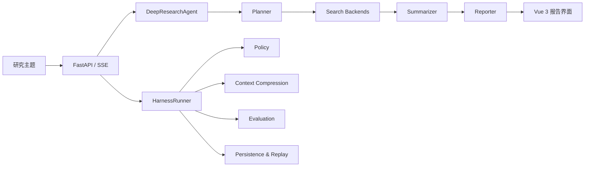
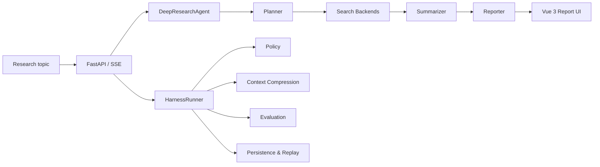

<div align="center">

**🌐 Language** &nbsp;|&nbsp; [**中文**](#中文) &nbsp;|&nbsp; [**English**](#english)


**Deep research workflow + governed agent harness**

</div>

---

<a id="中文"></a>

# HelloAgents 深度研究助手

一个基于 [Datawhale Hello-Agents](https://github.com/datawhalechina/hello-agents) 的深度研究应用。它不仅完成“规划 → 检索 → 总结 → 报告”的研究流程，还通过轻量级治理运行时（Harness Runtime）记录策略决策、评估结果和可回放的运行轨迹。

## ✨ 项目亮点

| 能力 | 价值 |
|------|------|
| 多搜索后端 | 支持 DuckDuckGo、Tavily、Perplexity、SearXNG，并提供重试与降级 |
| SSE 实时反馈 | 前端持续展示任务规划、检索进度和最终报告 |
| 运行治理 | 对能力调用执行策略判断，并记录 `run_id`、事件和决策 |
| 可评估、可回放 | 保存结构化运行记录，支持评分、历史查询与问题复盘 |
| 压缩研究记忆 | 复用压缩上下文继续追问，避免每轮从零开始 |
| 工程化验证 | 覆盖策略、评估器和 Harness API 的自动化测试 |

## 🎯 功能

- 接受开放式研究主题
- 将主题拆解为可执行的子任务
- 跨多个搜索引擎并行检索
- 为每个任务生成带来源的总结
- 输出结构化 Markdown 研究报告
- 记录受管控的运行：`run_id`、策略决策、事件日志、评估结果、压缩上下文，支持多轮追问

## 🧱 架构

后端有两个稳定层：

| 层级 | 职责 | 组件 |
|------|------|------|
| **研究执行层** | AI 工作流 | `DeepResearchAgent → Planner / Search / Summarizer / Reporter` |
| **治理层** | 运行管控 | `HarnessRunner → Policy → Context Compression → Evaluation → Persistence` |

> 治理层不是第二个业务工作流，而是围绕研究执行层的运行时控制层。



详细架构文档：[docs/ARCHITECTURE_OPTIMIZED.md](docs/ARCHITECTURE_OPTIMIZED.md)

## 📡 后端 API

| 方法 | 路径 | 说明 |
|------|------|------|
| `GET` | `/healthz` | 健康检查 |
| `POST` | `/research` | 发起研究（同步） |
| `POST` | `/research/stream` | 发起研究（SSE 流式） |
| `POST` | `/research/continue/stream` | 继续之前的研究（流式） |
| `POST` | `/harness/run` | 内部受控运行（含策略决策） |
| `GET` | `/harness/runs/{run_id}` | 查询历史运行记录 |
| `GET` | `/harness/scenarios` | 列出评估场景 |

`/research` 是公开业务入口，`/harness/run` 是内部工程入口。

## 📂 项目结构

```
helloagents-deepresearch/
├── backend/
│   ├── src/
│   │   ├── main.py                 # FastAPI 入口
│   │   ├── agent.py                # 核心研究工作流
│   │   ├── config.py               # 配置模型
│   │   ├── models.py               # 数据模型
│   │   ├── prompts.py              # LLM 提示词
│   │   ├── services/               # 业务服务
│   │   │   ├── planner.py          # 任务规划
│   │   │   ├── search.py           # 搜索分发（含重试+降级）
│   │   │   ├── summarizer.py       # 任务总结
│   │   │   ├── reporter.py         # 报告生成
│   │   │   └── note_agent.py       # 笔记管理
│   │   └── harness/                # 治理运行时
│   │       ├── runner.py           # 受控运行器
│   │       ├── policy.py           # 权限策略
│   │       ├── evaluator.py        # 运行评分
│   │       ├── compressor.py       # 上下文压缩
│   │       ├── context_manager.py  # 上下文生命周期
│   │       ├── recorder.py         # 运行持久化
│   │       ├── replay.py           # 重放
│   │       ├── scenarios.py        # 评估场景
│   │       └── event_bus.py        # 事件总线
│   └── tests/                      # 测试套件
├── frontend/
│   ├── src/
│   │   ├── App.vue                 # Vue 单文件组件
│   │   ├── main.ts                 # 应用入口
│   │   └── services/api.ts         # SSE 流式消费
│   └── package.json
├── docs/
│   ├── ARCHITECTURE_OPTIMIZED.md
│   └── TECHNICAL_DEEP_DIVE.md
├── CHANGELOG.md
└── README.md
```

## 🚀 本地开发

### 环境要求

- Python ≥ 3.10
- Node.js ≥ 18
- [uv](https://github.com/astral-sh/uv)（推荐）或 pip

### 配置

```bash
cp backend/.env.example backend/.env
# 编辑 backend/.env，填入 API Key 和模型配置
```

### 启动

**后端：**
```bash
cd backend
uv run python src/main.py
# 或：pip install -e . && python src/main.py
```

**前端：**
```bash
cd frontend
npm install
npm run dev
```

后端默认地址：`http://localhost:8000`

## 📚 文档导览

- [优化后的系统架构](docs/ARCHITECTURE_OPTIMIZED.md)
- [技术深度分析](docs/TECHNICAL_DEEP_DIVE.md)
- [版本变更记录](CHANGELOG.md)

## 📦 治理运行时输出

受管控的运行持久化在：

```
./output/harness_runs/
```

每次运行产生：
- 一个最终 JSON 记录
- 一条 JSONL 索引条目
- 一个事件日志

## 🎯 当前阶段

- 保持研究 Agent 简单
- 将运行管控集中到治理层
- 复用压缩上下文支持多轮追问
- 持续扩展评估和回放能力

## 🔎 来源与许可

本项目以 [Datawhale Hello-Agents 第 14 章自动化深度研究智能体](https://github.com/datawhalechina/hello-agents/blob/main/docs/chapter14/Chapter14-Automated-Deep-Research-Agent.md) 为基础，并扩展了治理运行时、评估、回放、上下文压缩、多轮追问和测试。

上游教程仓库采用 **CC BY-NC-SA 4.0**；同时，本仓库的 `backend/pyproject.toml` 保留了原始代码中的 **MIT / Lance Martin** 元数据。由于仓库包含不同来源的材料，在完成逐文件来源梳理前，不应将整个仓库简单声明为单一 MIT 许可。使用或再分发时，请同时遵守相应上游材料的许可与署名要求。

---

<a id="english"></a>

# HelloAgents Deep Research

A Deep Research application built on [Datawhale Hello-Agents](https://github.com/datawhalechina/hello-agents). Beyond the core plan → search → summarize → report workflow, it adds a lightweight harness runtime that records policy decisions, evaluation results, and replayable execution traces.

## ✨ Highlights

| Capability | Why it matters |
|------------|----------------|
| Multiple search backends | DuckDuckGo, Tavily, Perplexity, and SearXNG with retry and fallback |
| SSE progress streaming | The UI continuously displays planning, search progress, and the final report |
| Run governance | Applies capability policies and records `run_id`, events, and decisions |
| Evaluation and replay | Persists structured runs for scoring, inspection, and debugging |
| Compressed research memory | Reuses compact context for follow-up research instead of starting over |
| Engineering checks | Automated coverage for policies, evaluators, and Harness API behavior |

## 🎯 What It Does

- Accepts an open-ended research topic
- Plans the topic into actionable sub-tasks
- Searches across multiple search backends with retry + fallback
- Summarizes each task with sources
- Produces a structured Markdown research report
- Records managed runs with `run_id`, policy decisions, event logs, evaluation results, and compressed follow-up context

## 🧱 Architecture

Two stable layers in the backend:

| Layer | Responsibility | Components |
|-------|---------------|------------|
| **Research Execution** | AI workflow | `DeepResearchAgent → Planner / Search / Summarizer / Reporter` |
| **Governance** | Run control | `HarnessRunner → Policy → Context Compression → Evaluation → Persistence` |

> The harness is not a second business workflow — it is the runtime control layer around the existing Deep Research workflow.



Detailed architecture notes: [docs/ARCHITECTURE_OPTIMIZED.md](docs/ARCHITECTURE_OPTIMIZED.md)

## 📡 Backend Endpoints

| Method | Path | Description |
|--------|------|-------------|
| `GET` | `/healthz` | Health check |
| `POST` | `/research` | Run research (sync) |
| `POST` | `/research/stream` | Run research (SSE streaming) |
| `POST` | `/research/continue/stream` | Continue previous research (streaming) |
| `POST` | `/harness/run` | Internal controlled run (with policy metadata) |
| `GET` | `/harness/runs/{run_id}` | Retrieve historical run record |
| `GET` | `/harness/scenarios` | List evaluation scenarios |

`/research` is the public business entrypoint. `/harness/run` is the internal engineering entrypoint.

## 📂 Project Layout

```
helloagents-deepresearch/
├── backend/
│   ├── src/
│   │   ├── main.py                 # FastAPI entrypoint
│   │   ├── agent.py                # Core research workflow
│   │   ├── config.py               # Configuration model
│   │   ├── models.py               # Data models
│   │   ├── prompts.py              # LLM prompts
│   │   ├── services/               # Business services
│   │   │   ├── planner.py          # Task planning
│   │   │   ├── search.py           # Search dispatch (retry + fallback)
│   │   │   ├── summarizer.py       # Task summarization
│   │   │   ├── reporter.py         # Report generation
│   │   │   └── note_agent.py       # Note management
│   │   └── harness/                # Governance runtime
│   │       ├── runner.py           # Controlled run executor
│   │       ├── policy.py           # Permission policy
│   │       ├── evaluator.py        # Run scoring
│   │       ├── compressor.py       # Context compression
│   │       ├── context_manager.py  # Context lifecycle
│   │       ├── recorder.py         # Run persistence
│   │       ├── replay.py           # Replay
│   │       ├── scenarios.py        # Evaluation scenarios
│   │       └── event_bus.py        # In-memory event bus
│   └── tests/                      # Test suite
├── frontend/
│   ├── src/
│   │   ├── App.vue                 # Vue SFC
│   │   ├── main.ts                 # App entry
│   │   └── services/api.ts         # SSE consumer
│   └── package.json
├── docs/
│   ├── ARCHITECTURE_OPTIMIZED.md
│   └── TECHNICAL_DEEP_DIVE.md
├── CHANGELOG.md
└── README.md
```

## 🚀 Local Development

### Prerequisites

- Python ≥ 3.10
- Node.js ≥ 18
- [uv](https://github.com/astral-sh/uv) (recommended) or pip

### Configuration

```bash
cp backend/.env.example backend/.env
# Edit backend/.env with your API keys and model settings
```

### Start

**Backend:**
```bash
cd backend
uv run python src/main.py
# Or: pip install -e . && python src/main.py
```

**Frontend:**
```bash
cd frontend
npm install
npm run dev
```

Default backend address: `http://localhost:8000`

## 📚 Documentation

- [Optimized architecture](docs/ARCHITECTURE_OPTIMIZED.md)
- [Technical deep dive](docs/TECHNICAL_DEEP_DIVE.md)
- [Changelog](CHANGELOG.md)

## 📦 Harness Outputs

Managed runs are persisted under:

```
./output/harness_runs/
```

Each run produces:
- One final JSON record
- One append-only JSONL index entry
- One per-run event log

## 🎯 Current Focus

- Keep the research agent simple
- Centralize run governance in the harness layer
- Reuse compressed context for follow-up research
- Expand evaluation and replay over time

## 🔎 Attribution and License Status

This project is based on [Chapter 14: Automated Deep Research Agent](https://github.com/datawhalechina/hello-agents/blob/main/docs/chapter14/Chapter14-Automated-Deep-Research-Agent.md) from Datawhale Hello-Agents, with additional work on run governance, evaluation, replay, context compression, follow-up research, and tests.

The upstream tutorial repository is licensed under **CC BY-NC-SA 4.0**, while `backend/pyproject.toml` retains **MIT / Lance Martin** metadata from the original code. Because the repository contains material from different sources, it should not be represented as uniformly MIT-licensed until file-level provenance has been reconciled. Reuse and redistribution must follow the applicable upstream license and attribution requirements.
