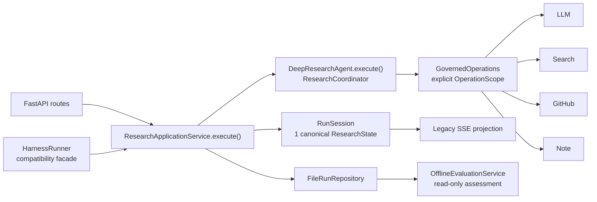

# HelloAgents Deep Research

基于 `hello-agents==0.2.9`、FastAPI 与 Vue 3 的本地深度研究应用。输入一个主题后，系统会规划任务、检索 Web 或 GitHub、生成逐项摘要，并汇总为 Markdown 报告。

> English: This project uses one canonical `ResearchApplicationService` / `RunSession` lifecycle. `HarnessRunner` and SSE are compatibility adapters, not a second runtime layer. See [Architecture](docs/ARCHITECTURE_OPTIMIZED.md) and [Technical Deep Dive](docs/TECHNICAL_DEEP_DIVE.md).

## Release 1.0.0

This release is a reliable, recoverable, and traceable local Deep Research
assistant. It supports multi-step research, multi-turn follow-up, durable run
snapshots, crash recovery, deterministic report validation, runtime telemetry,
and user-controlled history and memory.

Continual learning, autonomous self-training, Hermes-style experience learning,
and claims of perfect citation accuracy are intentionally outside the v1.0
contract.

## 当前架构



核心约束：

- 每次运行只有一个 `RunSession`，其中只有一个可变的 `ResearchState`。
- `ResearchApplicationService.execute()` 是唯一应用级生命周期；它是同步方法。
- LLM、Search、GitHub、Note 调用都携带显式 `OperationScope`，并在副作用发生前完成策略检查。
- 成功运行先生成终态快照并原子持久化，再确认 `run_completed`；客户端看到 `done` 时，`GET /runs/{run_id}` 已可读取记录。
- SSE 只是内部类型事件的兼容投影，不参与重建运行状态。
- `HarnessRunner` 只保留旧 `run()`、`stream()`、`load_record()` 接口的兼容外观，不拥有另一套工作流。
- follow-up 上下文从已持久化的父运行快照投影，不解析 SSE，也不复制一份在线状态。
- 整次运行的质量 assessment 是离线、只读操作；它不能修改报告、任务、`RunSession` 或运行终态。

详细设计见：

- [集成架构说明](docs/ARCHITECTURE_OPTIMIZED.md)
- [技术实现详解](docs/TECHNICAL_DEEP_DIVE.md)

## 功能

- 开放主题规划与并发任务执行
- DuckDuckGo、Tavily、Perplexity、SearXNG、Advanced 搜索后端
- 搜索重试、DuckDuckGo 降级和显式 opt-in 的安全投影缓存（默认关闭）
- GitHub 仓库识别与仓库上下文研究
- GitHub 固定 commit 快照、文件内容/行号级证据、覆盖率分析和可下载研究产物
- 逐任务流式摘要与最终 Markdown 报告
- 可选 NoteTool 任务笔记与结论笔记
- 类型化运行事件、operation 审计和安全元数据
- 版本化、脱敏、原子写入的运行快照
- 基于父快照的多轮 follow-up
- 兼容既有 SSE 事件与 `/harness/*` 接口
- 基于持久化 `RunSnapshot` 的离线质量 assessment

## 快速开始

### 环境要求

- Python 3.10+
- Node.js 18+
- [uv](https://docs.astral.sh/uv/)

### 安装后端

```powershell
cd backend
uv sync --frozen --group dev
```

依赖锁定在 `backend/uv.lock`，其中 `hello-agents` 精确固定为 `0.2.9`。

### 配置后端

```powershell
Copy-Item .env.example .env
```

常用环境变量：

| 变量 | 默认值 | 说明 |
|---|---:|---|
| `LLM_PROVIDER` | `ollama` | `ollama`、`lmstudio` 或 OpenAI-compatible 自定义 provider |
| `LOCAL_LLM` | `llama3.2` | 本地模型名 |
| `LLM_MODEL_ID` | 空 | 自定义模型 ID；设置后优先于 `LOCAL_LLM` |
| `LLM_REPORTER_MODEL_ID` | 空 | 可选的报告模型 ID |
| `LLM_API_KEY` | 空 | 自定义服务 API key；不会写入运行快照 |
| `LLM_BASE_URL` | 空 | 自定义 OpenAI-compatible 地址 |
| `OLLAMA_BASE_URL` | `http://localhost:11434` | Ollama 地址，运行时补全 `/v1` |
| `LMSTUDIO_BASE_URL` | `http://localhost:1234/v1` | LM Studio 地址 |
| `LLM_TIMEOUT` | `60` | 单次 LLM 请求超时秒数 |
| `LLM_MAX_TOKENS` | `2000` | 单次 LLM 最大输出 token |
| `SEARCH_API` | `duckduckgo` | `duckduckgo`、`tavily`、`perplexity`、`searxng` 或 `advanced` |
| `TAVILY_API_KEY` | 空 | Tavily 凭据，由搜索工具读取 |
| `PERPLEXITY_API_KEY` | 空 | Perplexity 凭据，由搜索工具读取 |
| `SEARXNG_URL` | 工具默认值 | SearXNG 地址，由搜索工具读取 |
| `MAX_WEB_RESEARCH_LOOPS` | `3` | 研究循环配置 |
| `MAX_CONCURRENT_TASKS` | `4` | 每次运行的任务并发上限，范围 1–16 |
| `FETCH_FULL_PAGE` | `true` | 是否获取完整页面内容 |
| `ENABLE_NOTES` | `true` | 是否启用 NoteTool |
| `NOTES_WORKSPACE` | `./notes` | NoteTool 工作目录 |
| `ENABLE_QUALITY_GATE` | `true` | 在线摘要质量检查与重试；不是离线整次运行 assessment |
| `ENABLE_GITHUB_RESEARCH` | `true` | 是否自动识别并研究 GitHub 仓库 |
| `GITHUB_TOKEN` | 空 | GitHub token；不会写入运行快照 |
| `GITHUB_API_BASE_URL` | `https://api.github.com` | GitHub-compatible API 地址 |
| `RUN_TIMEOUT_SECONDS` | 空 | 可选运行总时限，必须满足 `0 < value <= 86400` |

`HOST`、`PORT` 和 `CORS_ORIGINS` 是 composition root 读取的传输层环境变量，不会进入研究配置或持久化快照。直接运行 `src/main.py` 时默认只监听 `127.0.0.1:8000`；CORS 仅允许 `CORS_ORIGINS` 中显式列出的 HTTP(S) origin，默认覆盖本地前端的 5173、5174 和 3000 端口，并拒绝通配符。`LOG_LEVEL` 目前仍不是运行时配置项。

### 启动后端

```powershell
cd backend
uv run uvicorn src.main:app --reload --host 127.0.0.1 --port 8000
```

也可以让入口读取 `.env` 中的 `HOST` / `PORT`；未设置时仍使用 `127.0.0.1:8000`：

```powershell
uv run python src/main.py
```

如需对外提供服务，应在带认证和 TLS 的反向代理之后显式配置监听地址，并把 `CORS_ORIGINS` 限定为实际前端 origin。

### 启动前端

```powershell
cd frontend
npm ci
npm run dev
```

Vite 开发服务器使用 `http://localhost:5174`。前端默认访问 `http://localhost:8000`，可通过 `VITE_API_BASE_URL` 覆盖。

## HTTP API

| 方法 | 路径 | 当前用途 |
|---|---|---|
| `GET` | `/healthz` | 健康检查 |
| `POST` | `/research` | 同步研究；返回报告和任务列表 |
| `POST` | `/research/stream` | 新研究的 SSE 兼容流 |
| `POST` | `/research/continue/stream` | 基于已持久化父运行的 follow-up SSE 流 |
| `POST` | `/harness/run` | 兼容的内部同步入口；仍委托同一 Application 生命周期 |
| `GET` | `/runs/{run_id}` | 读取 canonical schema-v1 运行快照 |
| `GET` | `/harness/runs/{run_id}` | 已弃用的查询别名 |
| `GET` | `/harness/scenarios` | 兼容的离线 benchmark fixture 列表 |

基础请求：

```json
{
  "topic": "研究 Python Agent 框架的状态管理设计",
  "search_api": "duckduckgo",
  "parent_run_id": null
}
```

`/research/continue/stream` 要求非空、合法 UUID 格式的 `parent_run_id`。`/harness/run` 额外接受 `permission_mode`（`default` 或 `strict`）和 `metadata`。

SSE 是 `data: <json>\n\n` 帧。兼容事件包括 `status`、`github_repository`、`github_evidence`、`coverage_update`、`artifact_ready`、`todo_list`、`task_status`、`sources`、`task_summary_chunk`、`task_retry`、`report_note`、`final_report`，最终以 `done` 或 `error` 结束。每个投影事件都携带 `run_id`、`schema_version` 和单调递增的 `sequence`。

## 持久化与 follow-up

按上述命令从 `backend/` 启动时，默认运行仓库位于：

```text
backend/output/harness_runs/runs/<run_id>.json
```

每个成功运行只写一个 schema-v1 JSON envelope，其中包含 canonical snapshot 和紧凑 follow-up context。写入使用同目录临时文件、`fsync` 和 `os.replace`；配置只保存 `Configuration.safe_snapshot()` 的非敏感字段。

成功终态顺序是：

```text
validate terminal state
-> project follow-up context
-> prepare completed snapshot
-> atomically save snapshot
-> confirm run_completed
-> project SSE done
```

因此，`done` 不是“生成报告文本”的同义词，而是“完成快照已经可读取”的确认。父运行 follow-up 只读取该持久化快照，再构造有界的 `FollowupContext`。

## 策略与 operation scope

生产路径中的外部操作不会依赖全局“当前运行”变量。`OperationScope` 显式携带 run-bound `GovernedOperations` 和 task/attempt 坐标：

- LLM：`llm:invoke`
- Search：`search:web`，Perplexity 还要求 `search:premium`
- GitHub：`github:read`
- Note：`notes:read` / `notes:write`

策略先于真实副作用执行。operation 事件只记录 allowlist 元数据，例如 prompt/query hash、backend、role、仓库标识或 note action；不会记录完整 prompt、搜索正文、工具返回值或凭据。

## 取消与 deadline

- 关闭 `HarnessRunner.stream()` 迭代器会请求协作式取消。
- `RUN_TIMEOUT_SECONDS` 使用 monotonic deadline。
- coordinator 会在调度新任务、重试等待以及 governed operation 前后检查取消/deadline。
- 拒绝一项 operation 后，不再允许新的 operation start；此前已经开始的 operation 仍会记录 completed/failed 配对终态。
- `hello-agents==0.2.9` 的 LLM 公共 API 不提供在途调用的硬取消。若取消发生在 `invoke()` 或一次底层流读取期间，必须等待该调用返回，随后检查点才会把运行终止为 cancelled/deadline；系统不会宣称它已被立即中断。

## Windows SearchTool 控制台兼容

`hello-agents==0.2.9` 的 `SearchTool` 在构造时会向 stdout 打印包含 emoji 的提示。Windows 的 CP936 等控制台编码可能无法直接编码该提示。

`HelloAgentsSearchAdapter` 采用每线程懒加载，并在构造工具前检查真实 `sys.stdout`。必要时只把该流的编码错误策略调整为 `backslashreplace`；它不会临时替换、捕获或吞掉进程级 stdout，因此不会误截获并发 LLM 或日志输出。

## 离线质量 assessment

`research.evaluation.OfflineEvaluationService.evaluate(snapshot)` 只读取持久化 `RunSnapshot.output` 和 `RunSnapshot.followup_context`，返回冻结的 `ResearchAssessment`。assessment 包含 `run_id`、带时区的 `evaluated_at`、0–1 分数、tuple findings 和 `schema_version=1`。

该服务不在 `ResearchApplicationService.execute()` 的完成关键路径中，也不能修改运行状态或报告。`ResearchRunResult.evaluation_status` 当前为 `pending`；自动调度、assessment 持久化和查询 API 尚未实现。`RuleBasedEvaluator` / `EvaluationResult` 仅作为旧调用方的兼容适配器。

## 验证命令

```powershell
cd backend
uv run --with pytest python -m pytest -q
uv run ruff check src tests
uv run mypy src
uv run python -m compileall -q src

cd ../frontend
npm run test:api-contract
npm run build
```

## 当前限制与迁移兼容

- `HarnessRunner`、`HarnessRunRequest`、`RunContext`、`SummaryStateOutput` 和旧 Agent `run()` / `run_stream()` 仍保留一个兼容周期；新代码应使用 `ResearchCommand`、`RunSession`、`ResearchApplicationService.execute()` 和 `/runs/{run_id}`。
- 旧 `JsonlRunRecorder` 名称仍存在，但它已经委托 `FileRunRepository`，只写 canonical schema-v1 snapshot，不创建第二套索引或日志文件。
- application run 的创建、checkpoint、completed、failed、cancelled、rejected 和 report_incomplete 终态都会尽力持久化；只有同时满足 `validated=true` 与 `resumable=true` 的 checkpoint 才允许恢复。
- 文件仓库适合单进程本地运行；锁是进程内的，不是多进程数据库事务。
- 默认 facade 同时只执行一个顶层运行；单次运行内的研究任务按 `MAX_CONCURRENT_TASKS` 有界并发。
- `permission_mode="strict"` 中的 `ask` 目前直接阻断，因为尚无审批 UI。
- `/research` 的兼容同步响应只包含报告和任务，不返回 `run_id`；流式事件和 `/harness/run` 响应会返回 `run_id`。
- 当前事件只用于 observer、审计和兼容投影，不用于恢复在线状态；系统中不存在第二套 Harness 执行组件。

## License

MIT
