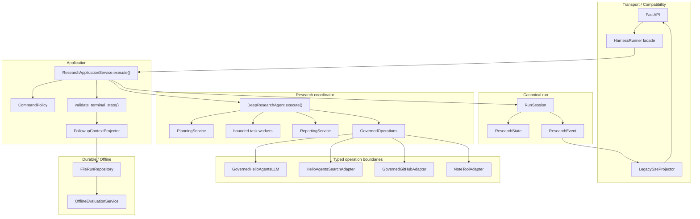
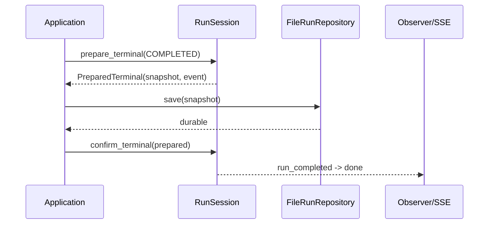

# 集成式研究执行架构

## 1. 定位

本项目不再把 Harness 作为独立治理层。应用只有一条权威执行路径：

```text
ResearchCommand
-> ResearchApplicationService.execute()
-> one RunSession / one ResearchState
-> DeepResearchAgent.execute()
-> terminal validation
-> follow-up projection
-> durable snapshot
-> one terminal event
```

`HarnessRunner` 和 SSE 都位于兼容边界：前者把旧同步/流式调用适配到 Application，后者把内部类型事件适配为前端仍在消费的平面字典。两者都不持有第二份研究状态，也不编排第二套工作流。

## 2. 架构不变量

1. 一次运行只有一个 `RunSession`，它内部只有一个 canonical `ResearchState`。
2. `ResearchApplicationService.execute()` 是唯一应用级生命周期入口，并且是同步方法。
3. coordinator 只通过 `RunSession` transition 修改 canonical state。
4. 状态 transition 成功后才提交不可变 `ResearchEvent`；事件不是在线状态的恢复来源。
5. LLM、Search、GitHub、Note 外部操作均在显式 `OperationScope` 下执行。
6. capability 策略检查发生在真实副作用之前。
7. 成功快照持久化完成后，`run_completed` 才能被 observer 看见。
8. `run_completed`、`run_failed`、`run_cancelled`、`run_rejected` 互斥。
9. follow-up context 由 canonical state 投影并随成功快照持久化；后续运行只读取父快照。
10. 整次运行的质量 assessment 离线读取快照，不修改运行状态，不阻塞完成。

## 3. 组件关系



### 3.1 Application

`backend/src/research/application.py` 中的 `ResearchApplicationService` 负责完整生命周期：

1. 注册 `run_id`，拒绝同进程内的重复活动运行。
2. 检查预先取消。
3. 执行 command-level policy preflight。
4. 若有 `parent_run_id`，从 repository 严格加载并解析父 `FollowupContext`。
5. 创建并启动 `RunSession`。
6. 调用一次 `ResearchCoordinator.execute(session, prior_context)`。
7. 校验报告存在且全部任务已进入终态。
8. 从 canonical state 投影当前 follow-up context。
9. prepare `COMPLETED` 终态与 immutable `RunSnapshot`。
10. 原子保存快照。
11. confirm `run_completed`，再返回 `ResearchRunResult`。

Application 没有 `stream()` 方法。流式路径通过 observer 订阅同一个同步 `execute()`，不会调用另一套业务逻辑。

### 3.2 RunSession 与 ResearchState

`RunSession` 是一次运行的唯一可变所有者，负责：

- `pending -> running -> terminal` 生命周期；
- canonical `ResearchState` 和任务 transition；
- UTC 时间、monotonic deadline、取消 token；
- policy decisions、metrics、follow-up context；
- 单调递增事件序列；
- operation start/terminal 配对和首次拒绝优先级；
- terminal prepare/confirm 两阶段边界。

`SummaryStateOutput`、`RunSnapshot`、SSE 字典和兼容 Harness model 都只是投影。它们不能反向覆盖 `ResearchState`。

### 3.3 ResearchCoordinator

`DeepResearchAgent` 目前保留历史类名，但在架构中的角色是 `ResearchCoordinator`：

- 规划普通主题，或识别 GitHub 仓库并生成固定仓库研究任务；
- 为每个任务建立不可变 work item；
- 使用有界 `ThreadPoolExecutor` 执行搜索和摘要；
- worker 只产生 detached message，coordinator 线程合并 canonical state；
- 读取/更新任务笔记；
- 生成最终报告和可选结论笔记。

任务并发上限是 `min(MAX_CONCURRENT_TASKS, task_count)`。顶层默认 `HarnessRunner` 同时只接纳一个运行，以避免共享 role-agent history 交错。

## 4. 显式 operation scope

`backend/src/research/operations.py` 提供三个核心值：

- `OperationScope`：run-bound `GovernedOperations` 加 task/attempt 坐标；
- `OperationSpec`：operation 名称、capabilities、安全 resource 元数据和稳定 ID；
- `GovernedOperations`：统一执行 authorize、控制检查、调用和审计。

### 4.1 固定调用顺序

```text
cancellation/deadline checkpoint
-> evaluate every required capability
-> append safe policy decisions
-> cancellation/deadline checkpoint
-> operation_started
-> invoke typed delegate
-> cancellation/deadline checkpoint
-> operation_completed | operation_failed
```

若策略返回 `deny` 或 `ask`：

```text
operation_rejected
-> close later operation admission
-> raise OperationRejectedError(first operation_id wins)
-> application terminal = rejected
```

一旦拒绝事件已经提交，其他线程不能再发布新的 `operation_started`。拒绝前已经启动的 operation 仍必须发布配对的 completed/failed 终态。

### 4.2 身份与重试

一次物理尝试由以下 tuple 唯一配对：

```text
(operation_id, task_attempt, fallback_index, operation_attempt)
```

搜索的同一逻辑调用在 backend fallback 和 retry 之间保持稳定 `operation_id`，同时递增 fallback/attempt 坐标。事件因此能表达物理尝试，而不会把失败重试误认为重复提交。

### 4.3 安全 resource envelope

operation event 不记录 delegate 的参数或返回值，只允许以下类别的有界元数据：

| 边界 | capability | 典型安全字段 |
|---|---|---|
| LLM | `llm:invoke` | `role`、`model_id`、`prompt_hash` |
| Search/cache | `search:web`、可选 `search:premium` | `query_hash`、`backend`、`cache_hit`、`stored` |
| GitHub | `github:read` | `owner`、`repo`、`resource_kind` |
| Note | `notes:read`、`notes:write` | `action`、`note_kind`、`note_id` |

完整 prompt、query、页面正文、LLM/tool 返回值、HTTP header 和凭据不会进入普通 operation event。

## 5. hello-agents 0.2.9 集成

项目固定使用已安装的 `hello-agents==0.2.9`，只调用其公开契约：

- `HelloAgentsLLM.invoke()` / `stream_invoke()`；
- `SimpleAgent.run()` / `stream_run()`；
- `ToolAwareSimpleAgent.run()` / `stream_run()` 的依赖契约；
- `SearchTool.run()`；
- `NoteTool.run()`。

`GovernedHelloAgentsLLM` 包装公开 LLM 方法，并要求调用方传入显式 scope。Planning、Summarization、Reporting 仍由 role-specific `SimpleAgent` 完成；每个并发摘要任务使用独立 Agent 实例，避免可变 history 共享。

`HelloAgentsSearchAdapter` 在每个 worker thread 中懒加载一个 `SearchTool(backend="hybrid")`。`NoteToolAdapter` 在真正构造/执行 `NoteTool` 前经过 note capability 检查。`GovernedGitHubAdapter` 在构造 GitHub client 和发起请求前检查 `github:read`。

## 6. 事件与 SSE 投影

内部 `ResearchEvent` 包含：

```text
schema_version, type, run_id, task_id?, operation_id?,
sequence, occurred_at, payload
```

payload 在提交前转为 detached JSON 并递归冻结。transition 与 event commit 在 session lock 下完成；observer 在 commit 后收到事件，因此不能观察到“事件已出现但状态尚未修改”的中间态。

`LegacySseProjector` 是纯 allowlist 投影：

| 内部事件 | 兼容 SSE |
|---|---|
| `run_started` | `status` |
| `repository_detected` | `github_repository` |
| `plan_created` | `todo_list` |
| task transitions | `task_status` |
| `sources_collected` | `sources` |
| `summary_delta` | `task_summary_chunk` |
| `task_retry_scheduled` | `task_retry` |
| `report_note_created` | `report_note` |
| `report_generated` | `final_report` |
| `run_completed` | `done` |
| failed/rejected/cancelled | `error` |

内部 policy/operation 事件不会直接暴露到旧 SSE。provider notice 也会转换为受信任的 code/message，而不是透传任意外部文本。

## 7. Durable terminal 与 repository

`FileRunRepository` 在 `<root>/runs/<uuid>.json` 保存一个 schema-v1 envelope。保存过程：

1. canonicalize UUID；
2. 构造并自校验脱敏 envelope；
3. 在目标目录创建 UTF-8 临时文件；
4. `json.dump`、flush、`fsync`；
5. `os.replace` 原子替换目标。

configuration 只保存 `Configuration.safe_snapshot()` allowlist。路径由 canonical UUID 构造，加载时会拒绝越界 ID、损坏 JSON 和不支持的 schema。

成功运行采用 prepare/save/confirm：



如果 required save 失败，Application 发布一个 `run_failed(code=persistence_failed)`，绝不先发布 `run_completed`。当前 Application 不自动持久化 failed/cancelled/rejected 结果；canonical `/runs/{run_id}` 面向已经成功持久化的运行。

## 8. Follow-up context

`FollowupContextProjector` 直接读取 canonical task output，产生版本化、有界的：

- 最多 5 条 `key_findings`；
- 最多 3 条 `key_sources`；
- 最多 10 条 `open_questions`。

finding/source 单项最多 180 字符。context 随成功快照保存，并带 `source_run_id`。后续命令提供 `parent_run_id` 时，Application 从 repository 加载父快照，验证 context 身份和 schema，再交给 `ResearchContextAssembler` 构造 coordinator 输入。

`ContextCompressor` 名称暂时保留给旧调用方，但它只是同一 deterministic projection 的兼容包装。

## 9. 离线 assessment

`research.evaluation` 定义：

- frozen `AssessmentFinding`；
- frozen `ResearchAssessment`；
- `OfflineEvaluationService.evaluate(snapshot)`。

`ResearchAssessment` 包含 canonical `run_id`、timezone-aware `evaluated_at`、0–1 `score`、tuple `findings`、`schema_version=1`，并提供 detached JSON-ready serialization。

evaluation 只读取 `RunSnapshot.output` 和 `RunSnapshot.followup_context`。它不接收 `RunSession`，不修改 snapshot，不改变运行 status，不重写报告，也不延迟 `run_completed`。`harness.evaluator.RuleBasedEvaluator` 与 `EvaluationResult` 只保留兼容形状并委托该服务，不保留第二份评分算法。

当前 Application 仅返回 `evaluation_status="pending"`；自动调度、assessment repository 和 HTTP 查询尚未实现。

## 10. 取消、deadline 与拒绝优先级

`CancellationToken` 与 `RUN_TIMEOUT_SECONDS` 提供协作式控制：

- 调度任务和 operation start 前检查；
- blocking operation 返回后检查；
- summary stream 的每个 chunk 前后检查；
- 搜索重试使用可取消 wait；
- 关闭 facade stream 时直接取消同一个 token。

raw token cancellation 与 operation start commit 使用同一 token guard 排序，避免“取消已发生但仍发布新 start”。动态拒绝提交后，session 记录 first rejection，并在 run-level checkpoint 中让 rejection 优先于竞争的 cancellation/deadline。

`hello-agents==0.2.9` 的 LLM 公共方法没有可传递的协作取消句柄。取消发生在一次 in-flight `invoke()` 或底层 stream read 中时，调用不能被硬中断；运行要等它返回，随后才记录 operation failure 和 cancelled/deadline 终态。

## 11. Windows SearchTool stdout guard

0.2.9 `SearchTool` 构造时会打印含 emoji 的 console notice。Windows CP936 stdout 可能抛出 `UnicodeEncodeError`。

`_preserve_stdout_for_search_tool_notices()` 在 SearchTool 懒构造前：

1. 检查当前真实 `sys.stdout.encoding` / `errors` 能否编码 notice sample；
2. 能编码则不修改；
3. 不能编码且 stdout 支持 `reconfigure()` 时，仅设置 `errors="backslashreplace"`；
4. 不替换 `sys.stdout`，不使用跨线程 redirect，也不吞掉并发输出。

该 guard 已用真实 venv、`PYTHONIOENCODING=cp936` 和并发 stdout 测试覆盖。

## 12. 兼容边界

| 历史接口 | 当前实现 | 新代码建议 |
|---|---|---|
| `HarnessRunner.run/stream/load_record` | 委托一个 Application + repository | 直接依赖 Application/typed observer |
| `HarnessRunRequest` | `ResearchCommand` alias | `ResearchCommand` |
| `RunContext` | `RunSession` alias | `RunSession` |
| `HarnessEvent` | `ResearchEvent` alias | `ResearchEvent` |
| `JsonlRunRecorder` | `FileRunRepository` 兼容包装，不写独立 JSONL | `FileRunRepository` |
| Agent `run()` / `run_stream()` | coordinator 的 direct legacy projection，不包含 Application 持久化语义 | `ResearchApplicationService.execute()` |
| `/harness/runs/{run_id}` | deprecated alias | `/runs/{run_id}` |

`/research`、`/research/stream`、`/research/continue/stream` 和 `/harness/run` 最终都进入同一个 Application lifecycle；差异只在请求/响应投影。

## 13. 已知限制

- 无法硬取消 in-flight hello-agents 0.2.9 LLM 调用。
- 文件 repository 只有进程内锁，适合本地单进程，不替代数据库事务。
- 默认 facade 顶层运行并发为 1；任务内部并发可配置为 1–16。
- `ask` 没有审批 UI，因此视为阻断。
- 非完成终态目前不进入 canonical repository。
- offline assessment 尚无自动调度、独立持久化和查询 API。
- `/research` 同步兼容响应不包含 `run_id`。
- 当前系统不从事件恢复在线状态，也不实现完整 Event Sourcing。
