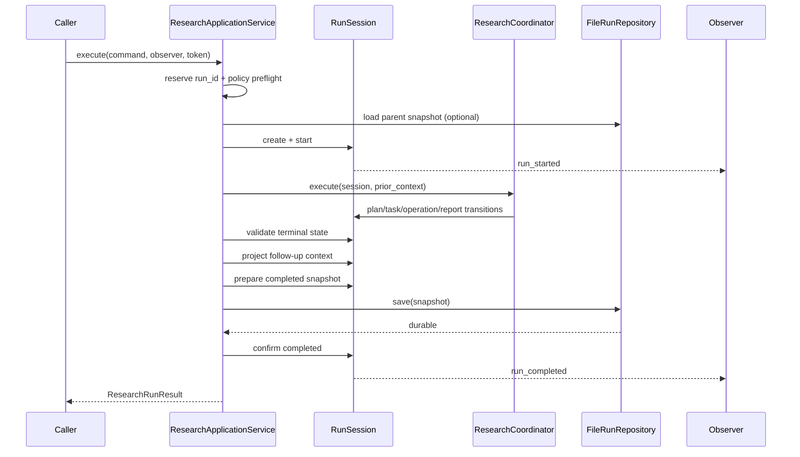

# HelloAgents Deep Research 技术详解

本文描述当前代码的实际运行契约。核心代码位于 `backend/src/research/`；`harness/` 只保留策略和旧接口适配，不再代表独立架构层。

## 1. 范围与非目标

当前实现的目标是：在不升级 `hello-agents==0.2.9` 的前提下，把同步、流式、follow-up、策略、operation 审计和持久化统一到一个应用生命周期。

明确不包含：

- 升级、fork 或 vendor hello-agents；
- 依赖 hello-agents 私有字段；
- 完整 Event Sourcing；
- 全异步 coordinator；
- 分布式 worker、消息 broker 或数据库；
- 对 in-flight 0.2.9 LLM 调用的硬取消；
- 在请求完成关键路径中做整次运行评分。

## 2. 源码地图

```text
backend/src/
├── main.py                         FastAPI composition root 与 HTTP/SSE 投影
├── agent.py                        ResearchCoordinator；历史类名 DeepResearchAgent
├── config.py                       frozen Pydantic Configuration
├── models.py                       ResearchState、TodoItem、legacy output
├── research/
│   ├── application.py              唯一 Application 生命周期
│   ├── session.py                  RunSession transition、控制与事件提交
│   ├── contracts.py                command/event/snapshot/result 类型
│   ├── ports.py                    coordinator/repository/policy/observer Protocol
│   ├── operations.py               OperationScope、OperationSpec、governance
│   ├── adapters.py                 LLM/Search/GitHub typed adapters
│   ├── context.py                  follow-up projection 与 prompt context assembly
│   ├── repository.py               schema-v1 原子文件仓库
│   ├── validation.py               在线 terminal correctness validation
│   ├── legacy_sse.py               内部事件到旧 SSE 的纯投影
│   ├── observers.py                observer 组合与安全边界
│   └── evaluation.py               离线 RunSnapshot assessment
├── services/
│   ├── planner.py                  任务规划
│   ├── search.py                   搜索、重试、fallback、cache
│   ├── summarizer.py               逐任务摘要
│   ├── reporter.py                 最终报告
│   ├── github_research.py          GitHub REST 数据收集
│   └── note_agent.py               NoteToolAdapter；保留 NoteSubAgent alias
└── harness/
    ├── runner.py                   Application 的兼容 facade
    ├── policy.py                   command 与 operation capability 策略
    ├── evaluator.py                offline evaluator 兼容 API
    ├── recorder.py                 canonical repository 兼容 API
    ├── compressor.py               follow-up projection 兼容 API
    ├── models.py                   历史名称与 response adapter
    └── scenarios.py                offline/benchmark fixtures
```

## 3. Canonical contracts

### 3.1 ResearchCommand

`ResearchCommand` 是冻结 dataclass：

```python
ResearchCommand(
    topic: str,
    config: Configuration,
    run_id: str = uuid4().hex,
    metadata: Mapping[str, Any] = {},
    permission_mode: str = "default",
    caller_mode: str = "public",
    parent_run_id: str | None = None,
)
```

构造边界会：

- 拒绝空白 topic；
- 仅接受 `default` / `strict` permission mode；
- 仅接受 `public` / `internal` caller mode；
- deep-copy frozen `Configuration`；
- 把 metadata 转为可 JSON 序列化且递归冻结的值；
- 把 `run_id` 与可选 `parent_run_id` 规范化为小写 UUID hex。

文件路径从规范化 UUID 生成，不接受路径片段、扩展名或任意调用方文本。

### 3.2 RunSession 与 ResearchState

每个 command 创建一个 `RunSession`：

```text
RunSession
├── command: immutable ResearchCommand
├── state: one mutable ResearchState
├── status / timestamps / error
├── metrics / policy_decisions / followup_context
├── cancellation_token / monotonic deadline
├── ordered immutable ResearchEvent list
└── operation pairing and first-rejection state
```

`ResearchState` 记录 topic、canonical todo items、最终报告、笔记标识和 GitHub context。worker 不直接修改它；coordinator 收到 detached worker message 后调用 session transition 合并。

生命周期状态：

```text
pending -> running -> completed
                   -> failed
                   -> cancelled
                   -> rejected
```

只有 terminal prepare/confirm 可以结束已启动 session。四类 terminal event 互斥且只能提交一次。

### 3.3 ResearchEvent

`ResearchEvent` 是冻结、schema-versioned 事实：

```python
{
  "schema_version": 1,
  "type": "operation_started",
  "run_id": "...",
  "task_id": 1,
  "operation_id": "...",
  "sequence": 8,
  "occurred_at": "...+00:00",
  "payload": {...}
}
```

payload 在 event 构造时复制、校验 JSON 可序列化，并递归冻结。`RunSession` 在同一锁内先修改 state、再分配 sequence、再 commit event；observer 通知在 commit 之后排队处理。

当前内部事件包括：

- run：started、completed、failed、cancelled、rejected；
- plan/task：plan created、task started/completed/skipped/failed/retry；
- data/report：repository detected、sources collected、summary delta、report note、report generated；
- operation：started、completed、failed、rejected。

### 3.4 RunSnapshot 与 ResearchRunResult

`RunSnapshot` 是 immutable persistence value，包含：

- run/topic/status/timestamps/parent；
- detached output；
- flat, versioned follow-up context；
- safe metrics 与 policy decisions；
- `Configuration.safe_snapshot()`；
- immutable events；
- optional stable `RunError`；
- `schema_version=1`。

`ResearchRunResult` 是进程内返回值，兼容输出仍使用 `SummaryStateOutput`，并额外返回 run status、stable error、metrics、follow-up context、policy decisions 和 `evaluation_status="pending"`。

## 4. 唯一 Application 生命周期

`ResearchApplicationService.execute()` 的签名：

```python
execute(
    command: ResearchCommand,
    *,
    observer: ResearchEventObserver = NULL_OBSERVER,
    cancellation: CancellationToken = NEVER_CANCELLED,
) -> ResearchRunResult
```

它是同步方法，也是唯一应用级执行入口。

### 4.1 正常路径



Application 对同一 `run_id` 维护进程内 active set。重复活动 ID 返回 `run_already_active`，而不是让两个生命周期写同一运行。

### 4.2 Parent load

提供 `parent_run_id` 时：

1. repository 必须返回 `RunSnapshot`；
2. snapshot ID 必须等于请求 ID；
3. status 必须是 `COMPLETED` 且有 `completed_at`；
4. follow-up context 必须恰好包含 schema、source ID、findings、sources、questions；
5. `source_run_id` 必须与父 ID 相同；
6. 数量和文本预算必须满足 projector 约束。

读取暂时失败后，Application 会再次读取，以区分同进程中“父运行仍活跃、尚未 durable”的 `parent_pending` 与真正的 `parent_not_found`。

### 4.3 Terminal correctness 与 quality assessment 的边界

`validate_terminal_state(session)` 是在线 correctness check，只验证：

- canonical report 是非空文本；
- 每个计划任务均为 `completed`、`failed`、`skipped` 或 `cancelled`。

这不是质量评分。整次运行分数与 findings 由离线服务读取 persisted snapshot 生成，不能改变在线结果。

### 4.4 错误结果

Application 使用稳定 code，禁止把原始 exception 文本返回给客户端：

| 场景 | RunStatus | code |
|---|---|---|
| command preflight deny | `rejected` | `policy_rejected` |
| dynamic operation deny | `rejected` | `operation_rejected` |
| cancellation | `cancelled` | `cancelled` |
| monotonic deadline | `cancelled` | `deadline_exceeded` |
| parent 不存在/未 durable/损坏 | `failed` | `parent_not_found` / `parent_pending` / `parent_corrupt` |
| policy 实现异常 | `failed` | `policy_error` |
| coordinator 异常 | `failed` | `coordinator_failed` |
| terminal 校验失败 | `failed` | `terminal_validation_failed` |
| context 投影失败 | `failed` | `context_projection_failed` |
| required save 失败 | `failed` | `persistence_failed` |

当前仅 completed snapshot 由 Application 自动保存。其他终态会安全返回并发布 terminal event，但 canonical run repository 中没有对应记录。

## 5. Coordinator 与并发

### 5.1 普通主题

普通研究流程：

```text
planner LLM
-> canonical plan install
-> bounded task workers
     -> search/cache/retry/fallback
     -> context preparation
     -> summarizer stream
     -> optional summary quality retry
-> coordinator merges worker messages
-> optional task note updates
-> reporter LLM
-> optional conclusion note
-> canonical report transition
```

在线 `ENABLE_QUALITY_GATE` 只检查单个摘要并可能细化 query 重试。它与离线 `ResearchAssessment` 的用途和生命周期不同。

### 5.2 GitHub 主题

启用 `ENABLE_GITHUB_RESEARCH` 后，coordinator 可识别仓库目标。`GovernedGitHubAdapter` 先授权 `github:read`，再创建 client 并收集有界仓库 context。canonical event/output 保留受控 repository metadata、source strategy 和稳定 notice code；token、HTTP header 和任意外部错误文本不进入普通 event。

GitHub 仓库路径使用既有的固定研究任务和报告 context，不另建 lifecycle。

Evidence/Intelligence 层在同一 Run 内生成版本化 repository snapshot。若能取得
commit SHA，客户端会从 `contents` API 有界读取少量架构相关文本文件，并把源码按行号
切成 `source_code` evidence；每条记录都带 `commit_sha`、`file_path`、`line_start`、
`line_end` 和 commit-pinned blob URL。原始源码不会进入普通 SSE 或 operation event，
只进入受控的 Run output/evidence artifact。报告中的 GitHub URL 会经过 evidence ledger
规范化，前端可从 Evidence Drawer 打开固定源码位置。

### 5.3 Worker ownership

任务 worker 接收冻结的 `_TaskWorkItem`，其中包含文本输入、config snapshot、scope 坐标和 typed adapters。worker 通过 bounded queue 发送：

- sources；
- summary delta；
- retry；
- completed；
- skipped。

只有 coordinator thread 调用 `RunSession.start_task/record_sources/append_task_summary/complete_task/...`。这保证 canonical state 和 event sequence 不依赖 worker 完成顺序。

### 5.4 有界执行

单次运行 worker 数量：

```python
min(config.max_concurrent_tasks, len(work_items))
```

结果 queue 容量与 worker 数量成比例。executor 在退出时 `shutdown(wait=True, cancel_futures=True)`，不创建 daemon worker。控制异常会设置 stop event、请求 cancellation，并等待已启动 worker 收尾。

## 6. Governed operations

### 6.1 OperationScope

`OperationScope` 是显式、不可变的 per-invocation context：

```python
OperationScope(
    operations: GovernedOperations,
    task_id: int | None = None,
    task_attempt: int = 1,
    fallback_index: int = 1,
)
```

它不使用 thread-local “当前 run”。同一个 coordinator 实例也不会把 run scope 存在对象字段中。

### 6.2 OperationSpec

`scope.spec()` 创建：

- dotted `operation_name`；
- 一个或多个 `domain:action` capability；
- allowlisted resource；
- UUID operation ID；
- task attempt、operation attempt、fallback index。

`pairing_key` 是 `(operation_id, task_attempt, fallback_index, operation_attempt)`。重复 start、重复 terminal、start 后 reject、没有 start 的 completed/failed 都会触发 invalid transition。

### 6.3 GovernedOperations.call

```text
pure cancellation/deadline check
-> capability evaluation
-> append safe decisions
-> pure cancellation/deadline check
-> atomic operation admission + start
-> callback
-> pure cancellation/deadline check
-> completed or failed
```

callback 返回值原样交还 typed caller，但不会复制进 event。失败只记录 stable code 和 duration。

### 6.4 GovernedOperations.stream

stream 是 lazy 的：创建 iterator 本身不会授权或发出 start；首次迭代才执行同样的 authorize/start 流程。每次拉取 chunk 前后检查 cancellation/deadline。正常耗尽记录 completed，异常、关闭或控制信号记录 failed，并尽力关闭底层 iterator。

### 6.5 Rejection admission latch

`operation_rejected` 与“关闭后续 start admission”在同一个 session critical section 中提交。observer 能看到 rejection 时，任何新 operation 都已经不能 start。

并发控制的优先级是：

```text
first committed operation rejection
> competing raw cancellation/deadline
```

因此 Agent 和 Application 最终都归一为 first rejection 的 `operation_id`。拒绝前 active operation 不会被伪装成 rejected；它仍然完成或以 cancellation/deadline failed 收尾。

## 7. Typed external adapters

### 7.1 LLM

`GovernedHelloAgentsLLM` 包装 delegate 的公开方法：

```python
invoke(messages, **kwargs) -> str
stream_invoke(messages, **kwargs) -> Iterator[str]
```

服务通过内部关键字传入 `OperationScope`。wrapper 移除该关键字，创建 `planner.complete`、`summarizer.stream`、`reporter.complete` 等 spec，然后调用 hello-agents delegate。resource 只包含 role、model ID 和 SHA-256 prompt hash。

wrapper 不访问 `_client`、`_history` 等私有字段。并发 summarizer 通过 factory 创建独立 `SimpleAgent`，避免共享可变 history。

### 7.2 Search

`HelloAgentsSearchAdapter.run(parameters)` 对接公开 `SearchTool.run()`。实例按 worker thread 懒创建，避免跨线程复用可能有状态的工具对象。

`dispatch_search()` 保留：

- configured backend；
- 每 backend 最多 3 次物理尝试；
- 非 DuckDuckGo backend 失败后的 DuckDuckGo fallback；
- 显式启用的首轮 search cache（默认关闭）；
- structured result、answer、source formatting；
- 可取消 backoff。

Perplexity 每个真实尝试需要 `search:web` 与 `search:premium`。如果 premium policy 拒绝，异常作为 control flow 立即上抛，不能降级到免费的 backend 以绕过策略。

cache read/write 也在同一 search scope 下审计。cache 必须由调用方显式 opt-in；持久化时只保留有界的 schema-v1 安全投影，URL 去除 userinfo、fragment 和已知敏感 query 参数，同时保留用于资源身份的普通参数及其重复值、空值，且不写入 `raw_content`、直接答案或 provider 扩展字段。默认应用在 ASGI startup 从解析后的 workspace parent 信任根扫描直属 cache 条目，拒绝 symlink/reparse 路径，并清除 legacy/未知 schema、过期文件和本应用遗留临时文件；扫描通过 512 条目、1 秒和单文件 256 KiB 的预算限制启动成本，直接 cache read 复用同一有界读取与精确 schema 校验。event 只记录 SHA-256 query hash；原 query 和 raw result 不进入 operation event。

### 7.3 GitHub

`GovernedGitHubAdapter.collect_repository_context()` 先构造 `github.collect` spec，再在 `github:read` 允许后创建 `GitHubResearchClient`。safe resource 只有 owner、repo、resource kind。

### 7.4 Note

`NoteToolAdapter` 支持 create/read/update/conclusion/batch read。生产路径传入 scope，因此 `NoteTool` 只会在 governed callback 内懒构造和执行。

写操作需要 `notes:write`；当前 read/update 兼容契约同时要求 `notes:read` 和 `notes:write`。`NoteSubAgent` 只是保留的类名 alias，并不是另一个 Agent lifecycle。

## 8. Policy

`HarnessPolicy` 名称保留兼容，但实现同时满足 `CommandPolicy` 与 operation policy Protocol。

command preflight 根据 config 推导：

```text
research:run
llm:invoke
search:web
report:export
+ search:premium   when Perplexity
+ github:read      when GitHub research enabled
+ notes:read/write when notes enabled
```

真实 operation 仍逐项重新执行 `evaluate_capability()`；preflight 只是快速拒绝，不是副作用授权边界。

| outcome | 行为 |
|---|---|
| `allow` | 继续 |
| `deny` | 阻断 |
| `ask` | 当前阻断；无审批 UI |

unknown capability 默认 deny。policy reason 在记录前转为固定可信文案，不透传自定义 secret-bearing reason。

## 9. Persistence

### 9.1 目录与 envelope

默认 composition root：

```python
HarnessRunner.build_default(base_path="./output/harness_runs")
```

从 `backend/` 启动时，文件为：

```text
backend/output/harness_runs/runs/<canonical-run-id>.json
```

文件顶层结构：

```json
{
  "schema_version": 1,
  "snapshot": { "...": "canonical snapshot" },
  "followup_context": { "...": "detached compact context" }
}
```

顶层 follow-up context 必须与 snapshot 内值一致。加载器严格校验 envelope shape、schema、run ID、event ID、时间、status、error 和敏感 key。

### 9.2 原子写入

写入在 repository root 对应的进程内共享 `RLock` 下完成：

```text
serialize + redact
-> deserialize self-check
-> NamedTemporaryFile in runs/
-> UTF-8 JSON
-> flush + fsync
-> os.replace target
```

失败时只清理经过目录与命名验证的临时文件。不会针对未经验证的计算路径做递归删除。

### 9.3 Redaction

配置仅保留：

```text
llm_provider, llm_model_id, llm_reporter_model_id,
search_api, max_web_research_loops, max_concurrent_tasks,
fetch_full_page, strip_thinking_tokens, use_tool_calling,
enable_notes, enable_quality_gate, enable_github_research,
run_timeout_seconds
```

API keys、tokens、base URLs、notes workspace、完整 config、raw source bodies 和 prompts 均不属于 canonical config projection。

### 9.4 Durable completion

`prepare_terminal(COMPLETED)` 创建即将保存的 snapshot 和 terminal event，但不修改 session status，也不通知 observer。repository save 成功后，`confirm_terminal()` 才设置 completed 和提交事件。

因此：

- `run_completed` observer 回调内立刻 load 能成功；
- SSE `done` 只可能来自该 committed event；
- save 失败只有 `run_failed`，没有 `run_completed`；
- cancellation 在成功 save 已经完成后到达不会把 durable completion 改写为 cancelled。

## 10. Follow-up context

### 10.1 Projector

`FollowupContextProjector` 从 `session.to_legacy_output()` 的 detached view 读取 task summary/status/source line：

```python
FollowupContext(
    source_run_id: str,
    key_findings: tuple[str, ...],   # <= 5, item <= 180 chars
    key_sources: tuple[str, ...],    # <= 3, item <= 180 chars
    open_questions: tuple[str, ...], # <= 10
    schema_version: int = 1,
)
```

它不读取 SSE 或 raw web body。

### 10.2 Assembler

`ResearchContextAssembler` 把已验证的 typed context 转为给 planner/coordinator 的有界 dict。父快照不直接注入 prompt；只有 allowlisted compact fields 会进入下一轮。

### 10.3 Compatibility envelope

旧调用方仍可得到 `run_summary` / `reasoning_memory` 外壳，但其内容来自同一 projector。不存在另一份可变 follow-up state。

## 11. Offline assessment

`research.evaluation` 的 public values：

```python
AssessmentFinding(
    severity: str,
    message: str,
    code: str | None = None,
)

ResearchAssessment(
    run_id: str,
    evaluated_at: datetime,       # timezone-aware
    score: float,                 # 0.0 .. 1.0
    findings: tuple[AssessmentFinding, ...] = (),
    schema_version: int = 1,
)
```

`OfflineEvaluationService.evaluate(snapshot: RunSnapshot) -> ResearchAssessment` 只读取：

```text
snapshot.output
snapshot.followup_context
```

当前规则保持旧评分语义：missing output 直接 0；missing tasks/report、incomplete tasks、missing summaries、missing follow-up context 分别产生扣分 finding，最终 score 下限为 0。

服务不读取或改变在线 session；测试会在 evaluate 前后比较 `snapshot.as_dict()` 及其稳定 JSON bytes。`as_dict()` 返回 detached JSON-ready value，调用方修改序列化结果不会修改 assessment。

`harness.evaluator.EvaluationResult` 和 `RuleBasedEvaluator` 保留旧返回形状，但内部委托 `OfflineEvaluationService`，不复制 scoring implementation。

Application 当前只标记 `evaluation_status="pending"`。没有自动后台 worker、assessment 文件或 assessment HTTP endpoint，文档和客户端不能把 `pending` 理解为“评分已经完成”。

## 12. SSE 与兼容 facade

### 12.1 HarnessRunner

`HarnessRunner` 持有：

- 一个 `ResearchApplicationService`；
- 与 Application 相同对象的 repository；
- bounded top-level executor 和 admission semaphore；
- bounded event queue；
- `LegacySseProjector`。

`run(request)` 提交一次 `application.execute()` 并适配 `ResearchRunResult`。`stream(request)` 仍只提交这一次 execute，同时把 observer 收到的 typed events 放入 queue。`load_record(run_id)` 直接调用 repository。

facade 不做 policy、context、evaluation 或 persistence orchestration。它也不从 SSE 字典还原任务状态。

### 12.2 Stream close

closeable iterator 的 `close()`：

1. 标记 consumer closed；
2. 若尚无 terminal，调用共享 `CancellationToken.cancel()`；
3. 尝试取消尚未开始的 future；
4. 不在 HTTP disconnect 路径等待 in-flight LLM。

Application future 若已经执行，会继续协作收尾。因为 0.2.9 限制，底层 LLM 返回前可能仍占用 worker。

### 12.3 LegacySseProjector

projector 对每种公开 event 使用字段 allowlist。兼容 event 始终含：

```text
type, run_id, schema_version, sequence
```

任务、仓库、notice、backend 和 terminal code 还会经过类型/枚举 allowlist。内部 operation audit 不暴露给旧前端。

### 12.4 Agent direct compatibility

`DeepResearchAgent.run()` 与 `run_stream()` 仍存在，但只是 coordinator 的 direct adapter。它们不拥有 Application 的 parent load、required persistence 和 canonical terminal 语义。特别是 direct `run_stream()` 的 `done` 是非 canonical 兼容 sentinel。

新代码和 HTTP composition 必须使用 `ResearchApplicationService.execute()`。

## 13. 取消与 deadline

### 13.1 CancellationToken

token 使用 `threading.Event` 加 `RLock`。raw `cancel()` 与 `RunSession.start_operation()` 共享 operation guard，使取消和 start commit 形成明确顺序：

- cancel 先获得 guard：start 抛 `CancellationRequestedError`，无 start event；
- start 先获得 guard：先 commit start，后续取消通过 failed terminal 配对。

特殊 `NEVER_CANCELLED` token 使用 no-op guard，避免无关 session 因共享 singleton 被串行化。

### 13.2 Deadline

`RunSession` 构造时把 `RUN_TIMEOUT_SECONDS` 转为 monotonic deadline。所有 deadline 比较使用 monotonic clock，不受系统墙钟调整影响。

`session.wait(timeout)` 会取调用 timeout 与剩余 deadline 的较小值，搜索 backoff 因此可以被 cancellation/deadline 打断。

### 13.3 Rejection precedence

run-level `raise_if_run_controlled()` 先检查 session 的 first rejection，再检查 cancellation/deadline。这防止 observer 在看到 `operation_rejected` 后直接取消 token，导致上层错误被错误降级成 cancelled。

active governed operation 的内部 post-check 仍使用纯 `raise_if_cancelled()`，因此它保留自己真实的 completed/cancelled/deadline terminal，而不是被改写成另一个 operation 的 rejection。

### 13.4 0.2.9 hard-cancel limitation

`HelloAgentsLLM.invoke()` / `stream_invoke()` 没有 run cancellation 参数，也没有安全的 public abort handle。项目只能在调用前、返回后、stream chunk 边界检查。

所以：

- 不声称 client disconnect 能立即停止远程生成；
- 不杀线程；
- 不访问私有 HTTP client 尝试 abort；
- 等调用返回后再提交 operation/run 控制终态。

## 14. Windows console compatibility

`hello-agents==0.2.9` 的 `SearchTool(backend="hybrid")` 构造会打印 emoji-bearing notice。CP936 stdout 在 strict errors 下可能无法编码。

`HelloAgentsSearchAdapter` 只在首次、每线程懒构造工具时调用安全 guard：

```text
read real sys.stdout encoding/errors
-> probe whether notice sample is encodable
-> if needed: stdout.reconfigure(errors="backslashreplace")
-> construct SearchTool
```

重要约束：

- 不把 `sys.stdout` 替换成临时 stream；
- 不使用会影响其他 worker 的 redirect；
- 不捕获或吞掉同时发生的 LLM/stdout 输出；
- 不改变可编码 console 的设置；
- 无 encoding 信息时不擅自修改。

测试在真实 venv 子进程中设置 `PYTHONIOENCODING=cp936`、`PYTHONUTF8=0`，验证 lazy import/构造能完成；另有并发输出 sentinel 测试验证 stdout identity 未变化。

## 15. HTTP API

### 15.1 Routes

| Method | Path | Request/response |
|---|---|---|
| `GET` | `/healthz` | `{"status":"ok"}` |
| `POST` | `/research` | `ResearchRequest` -> `ResearchResponse` |
| `POST` | `/research/stream` | `ResearchRequest` -> SSE |
| `POST` | `/research/continue/stream` | `ContinueRequest` -> SSE |
| `POST` | `/harness/run` | `HarnessRequest` -> compatibility `HarnessResponse` |
| `GET` | `/runs/{run_id}` | canonical `RunSnapshot.as_dict()` |
| `GET` | `/harness/runs/{run_id}` | deprecated query alias |
| `GET` | `/harness/scenarios` | offline/benchmark fixture metadata |

`ResearchRequest`：

```json
{
  "topic": "required string",
  "search_api": "optional enum",
  "parent_run_id": "optional canonical UUID"
}
```

`ContinueRequest` 要求 `parent_run_id`。`HarnessRequest` 额外包含 `permission_mode` 和 JSON `metadata`。

同步 `/research` 为旧兼容形状，只返回 `report_markdown` 和 `todo_items`。`/harness/run` 还返回 `run_id`、status、metrics、compressed context 与 policy decisions；findings 当前为空，因为 Application 不在线评分。

### 15.2 HTTP error mapping

| code | HTTP |
|---|---:|
| `invalid_command` | 400 |
| `policy_rejected` / `operation_rejected` | 403 |
| `parent_not_found` | 404 |
| `parent_pending` / `run_already_active` / `runner_busy` / `cancelled` | 409 |
| `deadline_exceeded` | 408 |
| repository/persistence/policy/coordinator/validation/application errors | 500 |

SSE 一旦建立连接，运行失败通过 terminal `error` event 表达，而不是在流中途改变 HTTP status。

## 16. Configuration

`Configuration` 是 frozen Pydantic model。`from_env()` 按字段名大写读取环境变量，再应用非 `None` overrides。

| Field / env | Default | Validation / use |
|---|---|---|
| `llm_provider` / `LLM_PROVIDER` | `ollama` | provider selector |
| `local_llm` / `LOCAL_LLM` | `llama3.2` | fallback model |
| `llm_model_id` / `LLM_MODEL_ID` | `None` | custom model |
| `llm_reporter_model_id` / `LLM_REPORTER_MODEL_ID` | `None` | optional reporter model |
| `llm_api_key` / `LLM_API_KEY` | `None` | secret, never persisted |
| `llm_base_url` / `LLM_BASE_URL` | `None` | custom API base, never persisted |
| `ollama_base_url` / `OLLAMA_BASE_URL` | `http://localhost:11434` | normalized to `/v1` |
| `lmstudio_base_url` / `LMSTUDIO_BASE_URL` | `http://localhost:1234/v1` | local OpenAI-compatible base |
| `llm_timeout` / `LLM_TIMEOUT` | `60.0` | per-call timeout |
| `llm_max_tokens` / `LLM_MAX_TOKENS` | `2000` | output limit |
| `search_api` / `SEARCH_API` | `duckduckgo` | enum: perplexity/tavily/duckduckgo/searxng/advanced |
| `max_web_research_loops` / `MAX_WEB_RESEARCH_LOOPS` | `3` | workflow setting |
| `max_concurrent_tasks` / `MAX_CONCURRENT_TASKS` | `4` | 1–16 |
| `fetch_full_page` / `FETCH_FULL_PAGE` | `true` | source fetching |
| `enable_notes` / `ENABLE_NOTES` | `true` | NoteTool boundary |
| `notes_workspace` / `NOTES_WORKSPACE` | `./notes` | secret-sensitive path, not persisted |
| `enable_quality_gate` / `ENABLE_QUALITY_GATE` | `true` | per-summary retry gate |
| `enable_github_research` / `ENABLE_GITHUB_RESEARCH` | `true` | repository detection |
| `github_token` / `GITHUB_TOKEN` | `None` | secret, never persisted |
| `github_api_base_url` / `GITHUB_API_BASE_URL` | `https://api.github.com` | not persisted |
| `run_timeout_seconds` / `RUN_TIMEOUT_SECONDS` | `None` | finite, `0 < value <= 86400` |
| `strip_thinking_tokens` / `STRIP_THINKING_TOKENS` | `true` | response cleanup |
| `use_tool_calling` / `USE_TOOL_CALLING` | `false` | structured output mode |

Tavily、Perplexity、SearXNG 的 tool-specific env 由 hello-agents/SearchTool 读取。前端只读取 `VITE_API_BASE_URL`。

`HOST`、`PORT` 和 `CORS_ORIGINS` 不属于 `Configuration`，而是由 composition root 单独读取的传输层环境变量，因此不会进入研究运行快照。`src/main.py` 默认监听 `127.0.0.1:8000`；CORS 使用显式 HTTP(S) origin allowlist，默认只覆盖本地开发端口 5173、5174 和 3000，拒绝 `*`、路径及带凭据的 origin。通过 Uvicorn CLI 启动时，CLI 的 host/port 参数优先；`LOG_LEVEL` 当前仍固定在入口中。

## 17. 开发、测试与构建

### 17.1 安装

```powershell
cd backend
uv sync --frozen --group dev
```

package metadata 显式安装 top-level modules，并发现 `research*`、`harness*`、`services*`。root requirement 与 lock 都固定 `hello-agents==0.2.9`。

### 17.2 启动

```powershell
cd backend
uv run uvicorn src.main:app --reload --host 127.0.0.1 --port 8000

cd ../frontend
npm ci
npm run dev
```

Vite 端口是 5174；API 默认地址是 8000。

若需外部访问，应将应用置于带认证和 TLS 的反向代理之后，显式选择监听地址，并将 `CORS_ORIGINS` 收窄为部署前端的实际 origin。

### 17.3 后端验证

```powershell
cd backend
uv run --with pytest python -m pytest -q
uv run ruff check src tests
uv run mypy src
uv run python -m compileall -q src
```

real-framework contract tests会验证 distribution version 0.2.9，以及 LLM、SimpleAgent、ToolAwareSimpleAgent、SearchTool、NoteTool 的公开方法确实来自已安装 distribution。测试只在对应 import 触发 `ModuleNotFoundError` 时安装最小 fallback，不会因模块尚未导入就覆盖 `sys.modules`。

### 17.4 前端验证

```powershell
cd frontend
npm run test:api-contract
npm run build
```

contract test验证 SSE reader 接受 schema/run/sequence，且必须看到 `done` 或 `error` terminal。production build 同时运行 `vue-tsc --noEmit`。

## 18. Migration compatibility

| 保留项 | 保留原因 | 权威替代 |
|---|---|---|
| `HarnessRunner` | 旧同步/流式调用方 | `ResearchApplicationService.execute()` |
| `HarnessRunRequest` | import compatibility | `ResearchCommand` |
| `RunContext` | import compatibility | `RunSession` |
| `HarnessEvent` | import compatibility | `ResearchEvent` |
| `HarnessRunResult` | `/harness/run` response adapter | `ResearchRunResult` |
| `RuleBasedEvaluator` / `EvaluationResult` | offline caller compatibility | `OfflineEvaluationService` / `ResearchAssessment` |
| `ContextCompressor` | old compressed envelope | `FollowupContextProjector` |
| `JsonlRunRecorder` | old recorder API | `FileRunRepository` |
| `NoteSubAgent` | old import | `NoteToolAdapter` |
| `/harness/runs/{run_id}` | old URL | `/runs/{run_id}` |

兼容名称不能反向引入第二份 state、第二次 coordinator 调用、在线评分或额外持久化格式。

## 19. Remaining limitations

1. in-flight hello-agents 0.2.9 LLM 调用无法硬取消。
2. 默认 facade 同时只执行一个顶层运行；这是对共享 role-agent history 的保守保护。
3. `FileRunRepository` 的锁只覆盖单进程；多 Uvicorn worker 需要数据库或跨进程锁方案。
4. Application 当前只保存成功完成的 snapshot，非完成终态没有 canonical GET 记录。
5. offline assessment 只有纯 service 与兼容 adapter，尚无自动调度、独立 repository 或 API。
6. `ask` 没有人工审批界面，因此等同阻断。
7. `/research` 同步 response 不包含 `run_id`。
8. 传输层的 `HOST`、`PORT`、`CORS_ORIGINS` 由 composition root 单独读取，尚未形成独立的强类型 transport config model；`LOG_LEVEL` 仍固定在入口中。
9. direct Agent `run()` / `run_stream()` 仍可绕过 Application；它们仅供迁移兼容，不提供 canonical persistence guarantee。
10. 不从事件恢复运行状态，也不提供完整 Event Sourcing。
