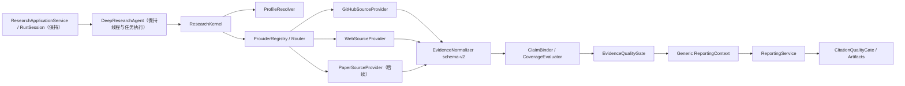

# 通用研究内核优化实施方案

> 状态：可执行
> 日期：2026-08-12
> 目标执行环境：当前仓库、当前对话，后续可交由 Luna Max 按任务顺序实施
> 基线：后端全量测试 `422 passed, 2 skipped, 22 subtests passed`

## 1. 目标

以一次小范围、兼容式改造建立通用研究内核，并让现有 GitHub 研究成为第一条正式接入链路。完成后，新增论文 Provider 不需要修改 `ResearchApplicationService`、`RunSession` 生命周期、任务线程模型或 SSE 终态协议。

本阶段交付四项核心能力：

1. `ResearchMode` 与版本化 `ResearchProfile`；
2. 可注册、可路由、受统一预算和权限治理的 `SourceProvider`；
3. 来源无关的 Evidence schema-v2、Claim—Evidence 绑定和 Coverage；
4. 报告前 Evidence Quality Gate 与报告后 Citation Quality Gate。

首个正式接入的生产 Provider 是 GitHub。Web 保持现有行为，并接入最小 Web Provider 适配器；Paper 只建立模式、契约和扩展测试，不在本阶段访问真实论文平台。

## 2. 明确不做

- 不重写 `ResearchApplicationService`。
- 不重写 `RunSession` 状态机、恢复算法或持久化事务顺序。
- 不改变 `ThreadPoolExecutor`、工作线程数量、队列合并或取消模型。
- 不增加新的 Agent、Planner、Summarizer 或 Reporter 角色。
- 不改变现有 SSE 终态类型、终态发布顺序和持久化先于终态的保证。
- 不升级或替换 `hello-agents==0.2.9`。
- 不在本阶段实现 OpenAlex、Crossref、PDF、BibTeX 或 Citation Snowball。
- 不在本阶段删除 GitHub schema-v1、`github_intelligence` 或旧前端字段。
- 不引入数据库、消息队列、异步运行时或通用工作流引擎。

## 3. 当前代码事实与改造边界

现有实现已经具备稳定运行底座，不需要另造运行时：

- `backend/src/research/application.py` 统一管理执行、恢复、终态校验和持久化。
- `backend/src/research/session.py` 是单一可变 Run 状态，管理检查点、事件序列和取消。
- `backend/src/agent.py` 保留现有有界线程池和 coordinator-only merge。
- `backend/src/research/contracts.py` 已有通用的 `EVIDENCE_COLLECTED`、`COVERAGE_UPDATED` 和 `ARTIFACT_READY` 事件。

当前专用耦合主要集中在以下位置：

- `backend/src/agent.py:_execute_governed()` 直接检测、收集和分支 GitHub 流程。
- `backend/src/agent.py:_create_github_research_tasks()` 固定写死 GitHub 任务模板。
- `backend/src/research/evidence.py` 中的基础对象部分通用，但 Bundle、快照和构建函数仍属于 GitHub schema-v1。
- `backend/src/services/reporter.py` 直接读取 `github_context` 和 `github_intelligence`。
- `backend/src/models.py`、`backend/src/research/session.py` 和恢复检查点只持久化 GitHub 专用研究字段。
- `backend/src/research/legacy_sse.py` 将通用 Evidence 事件固定投影为 `github_evidence`。
- Artifact 内容仍内嵌在 GitHub Bundle 和 Run JSON 中。

因此本方案只在 coordinator 与 Provider/证据/报告之间增加通用内核，不移动生命周期所有权。

## 4. 目标架构



关键原则：

- `ResearchKernel` 是 coordinator 内部的协作组件，不拥有 Run 生命周期。
- Provider 不持有跨 Run 可变状态；Run 级预算、取消和权限上下文通过参数传入。
- `RunSession` 只增加一次通用研究状态写入能力；以后新增 Provider 不再修改它。
- schema-v2 是新的内核真相，GitHub schema-v1 只作为输入兼容和输出投影存在。

## 5. 核心契约

### 5.1 ResearchMode 与模式选择

新增：`backend/src/research/profiles.py`

```python
class ResearchMode(str, Enum):
    WEB = "web"
    GITHUB = "github"
    PAPER = "paper"
```

模式解析优先级固定为：

1. 请求显式指定 `research_mode`；
2. 请求显式指定的 Profile 所属模式；
3. Provider `detect_target()` 的最高置信度结果；
4. 默认 `web`。

约束：

- 显式模式与 Profile 模式冲突时，在 Provider 调用前以 `invalid_research_profile` 拒绝。
- 自动检测不得只凭任意 `owner/repo` 片段把普通路径识别为 GitHub；严格识别规则的完整修复属于 GitHub v1.1，但本阶段至少保持当前测试行为不回退。
- `paper` 枚举和 Profile 契约本阶段可用；未注册真实 Paper Provider 时返回稳定的 `source_provider_unavailable`，不得回退成 Web 后伪装为论文研究。

`ResearchCommand` 加入两个可选、不可变字段：

- `research_mode: ResearchMode | None`
- `research_profile_id: str | None`

旧调用者不传值时保持自动检测；这两个字段必须进入检查点，恢复时不得重新推断。

### 5.2 ResearchProfile

`ResearchProfile` 必须是不可变、可版本化、可注入注册表的领域对象。建议字段：

```python
@dataclass(frozen=True, kw_only=True)
class ResearchProfile:
    profile_id: str
    version: int
    mode: ResearchMode
    dimensions: tuple[ResearchDimension, ...]
    task_templates: tuple[ResearchTaskTemplate, ...]
    source_priority: tuple[str, ...]
    retrieval_budget: RetrievalBudget
    coverage_policy: CoveragePolicy
    citation_policy: CitationPolicy
    report_sections: tuple[ReportSectionSpec, ...]
```

第一批内置 Profile：

| Profile | 模式 | 用途 |
|---|---|---|
| `web.default.v1` | `web` | 保持现有 Planner 生成任务和 Web 搜索行为 |
| `github.repository.v1` | `github` | 承接当前四个固定 GitHub 任务和多仓库比较任务 |
| `paper.abstract.v1` | `paper` | 只定义维度、预算和报告结构，等待后续 Provider |

`github.repository.v1` 的任务模板必须从 `_create_github_research_tasks()` 移出；方法可以暂时保留为兼容包装，但不得继续保存任务定义的唯一真相。

建议 GitHub Profile 维度：

- `overview`
- `architecture`
- `maintenance`
- `community`
- `license`
- 多仓库时追加 `comparison`

Profile 配置先采用代码内置对象 + `ResearchProfileRegistry` 注入，不在本阶段加载任意用户 YAML/JSON。API 只允许选择已注册 `profile_id`，避免把动态配置变成新的安全边界。

### 5.3 SourceProvider

新增：

- `backend/src/research/sources.py`
- `backend/src/research/providers/__init__.py`
- `backend/src/research/providers/github.py`
- `backend/src/research/providers/web.py`

Provider 协议保持同步，以匹配现有 coordinator 和线程模型：

```python
class SourceProvider(Protocol):
    provider_id: str
    supported_modes: frozenset[ResearchMode]

    def detect_target(
        self, request: ResearchRequestSpec, context: ProviderContext
    ) -> DetectionResult: ...

    def search(
        self, request: SourceSearchRequest, context: ProviderContext
    ) -> SourceSearchResult: ...

    def collect(
        self, target: SourceTarget, context: ProviderContext
    ) -> SourceCollection: ...

    def enrich(
        self, request: EnrichmentRequest, context: ProviderContext
    ) -> SourceCollection: ...
```

所有方法必须返回类型化结果，不返回裸 `Any`。允许在 `attributes` 中保存有界的 Provider 专用字段，但以下字段必须通用且必填：

- `provider_id`
- `source_kind`
- `source_id`
- `canonical_url`
- `requested_ref`
- `resolved_version`
- `captured_at`
- `collection_status`
- `notice_codes`

`ProviderContext` 至少包含：

- 当前 `OperationScope`；
- Run 取消/截止时间检查器；
- 线程安全 `RetrievalBudgetTracker`；
- Run ID 与 Profile ID；
- 安全时钟或 `captured_at` 工厂。

治理约束：

- Provider 不得直接绕过 `GovernedOperations` 发起网络请求。
- GitHub 继续使用 `github:read`；Web 继续使用现有 search 能力。
- 事件和 metrics 只能记录稳定 provider code、计数、耗时、缓存命中和限流状态，不记录 Token、Header、完整正文或原始异常文本。
- `RetrievalBudgetTracker` 必须加锁，因为多个现有任务线程会共享同一个 Run 预算。

### 5.4 Provider Registry 与 Router

新增 `ProviderRegistry` 和 `SourceRouter`：

- Registry 构造时拒绝重复 `provider_id`。
- Router 只按 Profile 的 `source_priority` 调用 Provider。
- 显式 Provider 失败时按 Profile 的降级规则继续，不能暗自改变 `ResearchMode`。
- Provider 返回空结果、限流或可恢复错误时生成稳定 Gap/Notice；取消、截止时间和策略拒绝必须原样向上传播。
- Provider 实例不得保存当前 Run 的 `OperationScope` 或结果缓存。

本阶段的 `GitHubSourceProvider` 只包装现有：

- `parse_github_repositories()`；
- `GovernedGitHubAdapter`；
- `GitHubResearchClient`；
- `GitHubRepositoryContext`。

不要在迁移时重写 GitHub HTTP 客户端。

`WebSourceProvider` 只包装现有 `dispatch_search()` / `HelloAgentsSearchAdapter`，保持搜索重试、页面抓取和安全检查不变。

## 6. 通用 Evidence schema-v2

新增：`backend/src/research/intelligence.py`

现有 `research/evidence.py` 暂时保留为 GitHub schema-v1 实现和兼容入口。不要原地把整个文件改成 v2，以免同时破坏 53 处现有引用。

### 6.1 通用来源与定位

建议核心对象：

```python
@dataclass(frozen=True, kw_only=True)
class SourceReference:
    provider_id: str
    source_kind: str
    source_id: str
    canonical_url: str
    requested_ref: str | None
    resolved_version: str | None
    captured_at: str
    content_hash: str

@dataclass(frozen=True, kw_only=True)
class EvidenceLocator:
    locator_type: str
    url: str
    file_path: str | None = None
    line_start: int | None = None
    line_end: int | None = None
    page_start: int | None = None
    page_end: int | None = None
    section: str | None = None
    paragraph: str | None = None
    fragment: str | None = None
```

Locator 校验规则：

- 行号必须成对合法，`1 <= line_start <= line_end`。
- 页码必须成对合法，`1 <= page_start <= page_end`。
- GitHub `source_code` 必须有 commit SHA、文件路径和 `#Lx-Ly` URL。
- Paper 摘要证据允许无页码，但必须标记 `evidence_level="abstract"`。
- 元数据证据不得伪装成全文证据。

### 6.2 Evidence、Claim、Coverage 与 Bundle

```python
@dataclass(frozen=True, kw_only=True)
class EvidenceRecord:
    evidence_id: str
    source: SourceReference
    evidence_type: str
    evidence_level: str
    title: str
    excerpt: str
    locator: EvidenceLocator
    attributes: Mapping[str, JsonValue]

@dataclass(frozen=True, kw_only=True)
class ClaimRecord:
    claim_id: str
    dimension: str
    statement: str
    confidence: str
    evidence_ids: tuple[str, ...]
    conflicting_evidence_ids: tuple[str, ...]
    limitations: tuple[str, ...]

@dataclass(frozen=True, kw_only=True)
class ResearchIntelligenceBundle:
    schema_version: int             # 固定为 2
    mode: ResearchMode
    profile_id: str
    profile_version: int
    sources: tuple[SourceReference, ...]
    evidence: tuple[EvidenceRecord, ...]
    claims: tuple[ClaimRecord, ...]
    coverage: CoverageDecision
    report_spec: GenericReportSpec
    artifact_manifest: ArtifactManifestV2
    evidence_frozen: bool
```

通用 ID 生成规则：

- `source_id` 由 Provider 提供的规范标识决定，例如 `github:owner/repo@sha`、`doi:10.x/...`。
- `evidence_id` 由 `source_kind + source_id + resolved_version + locator + excerpt_hash` 稳定生成。
- `claim_id` 由 `profile_id + dimension + normalized_statement` 稳定生成。
- 相同输入重复执行可得到相同 ID；`captured_at` 不参与 ID。

上限必须由 Profile 或内核常量约束：Evidence 数量、Excerpt 长度、单来源记录数、Artifact 数量、Gap Query 数量。不得把完整网页、完整 PDF 或完整仓库源码放入 Run JSON。

## 7. schema-v1 兼容策略

新增：`backend/src/research/compatibility.py`

必须保留现有：

- `GitHubEvidenceBundle`
- `github_evidence_bundle_from_dict()`
- `canonicalize_github_report()`
- 现有 GitHub schema-v1 测试与前端字段

兼容读取规则：

1. 如果存在 `research_intelligence.schema_version == 2`，直接读取 v2。
2. 如果只存在 `github_intelligence.schema_version == 1`，调用 `GitHubEvidenceV1Adapter.to_v2()` 在内存中迁移。
3. 旧 Run 文件不得在普通读取或恢复时被原地重写。
4. 新 GitHub Run 以 v2 作为内核真相，同时在 API/旧 SSE 边界生成 schema-v1 兼容投影。
5. 兼容投影不得成为第二个可变状态来源；所有更新先写 v2，再重新投影。

GitHub v1 → v2 映射：

| schema-v1 | schema-v2 |
|---|---|
| `RepositorySnapshot.repository` | `SourceReference.source_id` |
| `commit_sha` | `resolved_version` |
| `EvidenceItem.evidence_type` | `EvidenceRecord.evidence_type` |
| `source_url/file_path/line_*` | `EvidenceLocator` |
| `ResearchClaim.category` | `ClaimRecord.dimension` |
| `CoverageResult` | `CoverageDecision` |
| `ReportSpec` | `GenericReportSpec` |

无法映射的 Provider 专用字段放入有界 `attributes`，不得丢失 commit SHA、行号、许可证、Notice code 和 collection status。

## 8. Evidence Pipeline 与质量门禁

新增：

- `backend/src/research/pipeline.py`
- `backend/src/research/quality.py`

### 8.1 Pipeline 生命周期

`ResearchKernel` 在一个现有 Run 内只负责以下步骤：

```text
resolve profile
→ detect targets
→ provider collect/search
→ build profile tasks
→ 交还现有 worker 并发执行
→ normalize task sources + provider collections
→ bind claims to evidence
→ evaluate coverage
→ 最多一次 bounded enrich
→ re-evaluate
→ freeze evidence
→ allow or block report
```

接入 `DeepResearchAgent` 的最小改动：

1. 构造函数增加可注入 `research_kernel` 或 `provider_registry`，默认由生产 composition 创建。
2. `_execute_governed()` 中用 `kernel.prepare()` 替代直接 GitHub 分支。
3. 保持 `install_plan()`、`_prepare_work_items()`、`_execute_work_items()` 和线程模型不变。
4. worker 的 Web 搜索通过 `WebSourceProvider` 适配现有搜索调用，但保留原重试、摘要流和队列消息。
5. worker 完成后调用 `kernel.finalize()`，再进入现有 `evidence_completed` 检查点。
6. `_create_github_research_tasks()`、`_prepare_github_contexts()` 可暂时保留为一版兼容包装，生产路径不再直接依赖其固定模板。

### 8.2 Evidence Quality Gate（报告前）

`EvidenceQualityGate.evaluate(bundle, profile)` 必须是确定性的，不调用 LLM。至少检查：

- schema、Profile 和模式一致；
- 所有 Evidence 引用的 Source 存在；
- 所有 Claim 引用的 Evidence 存在；
- 核心 Claim 至少绑定一个 Evidence；
- required dimension 是否覆盖；
- 每维 Evidence 数量和独立来源数是否达到 Profile 规则；
- Locator 与 Evidence level 是否有效；
- 冲突证据是否显式记录；
- 版本、抓取时间和内容 hash 是否存在；
- Evidence 是否在预算和大小上限内。

`CoverageDecision` 至少返回：

- `coverage_score`
- `dimension_results`
- `missing_dimensions`
- `weak_claims`
- `conflicting_claims`
- `blockers`
- `warnings`
- `gap_queries`
- `retry_count`
- `allow_report`

执行语义：

- 第一次不通过且有 Gap 时，只允许一次 `enrich()`。
- 第二次仍不通过时不得调用 Reporter。
- 使用现有 `REPORT_INCOMPLETE` / `report_incomplete` 终态，不增加新的终态类型；门禁详情写入安全 metrics 和 Coverage 事件。
- `allow_report=False` 的测试必须断言 Reporter 完全未被调用。

为了复用现有应用层终态，可新增内部 `EvidenceGateBlockedError`，由 `ResearchApplicationService` 做一个窄 catch，并映射到现有 `report_incomplete`。不得借此改动其他异常优先级或终态持久化流程。

### 8.3 Citation Quality Gate（报告后）

通用报告规范要求核心结论使用稳定标记：

```text
[EVIDENCE:ev_xxx]
```

报告后门禁至少检查：

- 引用的 Evidence ID 全部存在；
- 每条 `reportable` Claim 至少在 Claim—Evidence 索引中出现；
- 外部 URL 必须来自 Evidence Locator，或由 Profile 明确允许；
- GitHub 源码 URL 保留 commit SHA 和 `#Lx-Ly`；
- 报告包含 Coverage/Limitations；
- 未通过门禁时沿用现有最多一次 report retry；第二次失败进入 `report_incomplete`。

为避免 LLM 遗漏可追踪信息，最终报告末尾由代码确定性追加：

- `Claim—Evidence Index`
- `Evidence References`
- `Coverage and Limitations`

这三部分只从冻结 Bundle 渲染，不由 LLM 自由生成。LLM 可以撰写正文，但不能生成新的 Evidence ID 或来源 URL。

## 9. Reporter 改造

新增 `GenericReportingContext`，由 `ResearchKernel` 或独立 builder 生成。`ReportingService` 只消费：

- topic；
- Profile 报告章节；
- 完成任务摘要；
- 通用 Claims；
- 通用 Evidence 摘要和 Locator；
- Coverage、冲突和限制；
- Note 引用。

`backend/src/services/reporter.py` 的 GitHub 专用 prompt 分支应移到兼容 builder，最终达到：

- Reporter 不读取 `state.github_context`；
- Reporter 不读取 `state.github_intelligence`；
- Reporter 不导入 `GitHubEvidenceBundle`；
- GitHub 与未来 Paper 使用同一个正文生成入口；
- Profile 控制报告章节和引用规则。

保留 `generate_report(state, notes_context, operation_scope=...)` 的现有调用签名作为一版兼容包装，内部立即转换为 `GenericReportingContext`。现有测试桩不需要一次性全部改写。

## 10. RunSession、持久化与 SSE 的最小加法改动

### 10.1 Canonical State

在 `ResearchState` / `SummaryStateOutput` 增加：

- `research_mode`
- `research_profile_id`
- `source_context`
- `research_intelligence`

保留：

- `github_context`
- `github_intelligence`

后两者标记为 compatibility projection。新内核逻辑只读写通用字段。

### 10.2 RunSession

一次性新增通用方法：

- `record_source_context(...)`
- `record_research_intelligence(...)`
- `replace_research_intelligence(...)`

现有 `record_repository()`、`record_github_intelligence()` 和 `replace_github_intelligence()` 保留，改为调用通用方法或兼容投影器。

检查点和恢复：

- 新检查点保存通用字段和 mode/profile。
- 恢复优先读取 v2；只存在 v1 时在内存适配。
- 保持 checkpoint schema envelope 版本不变，新增字段均为可选；不要求迁移旧文件。
- `evidence_completed`、`report_before_generation` 等现有 phase 名称不变。

### 10.3 SSE

内部事件继续复用：

- `EVIDENCE_COLLECTED`
- `COVERAGE_UPDATED`
- `ARTIFACT_READY`

事件 payload 增加安全字段：

- `research_mode`
- `profile_id`
- `provider_ids`
- `source_count`
- `bundle_schema_version`

旧投影规则：

- GitHub 模式继续输出现有 `github_repository` 和 `github_evidence`。
- 缺少 `research_mode` 的旧事件按 GitHub 处理，保证现有测试与旧 Run 回放。
- 非 GitHub 模式可增加 `research_source` / `research_evidence` 事件；这是加法事件，前端可以忽略。
- `coverage_update`、`artifact_ready` 和所有终态事件名称、顺序不变。
- SSE 永远不发送 Evidence excerpt、源码、论文摘要全文或 Artifact content。

## 11. Artifact 存储边界

本阶段建立通用 `ArtifactStore` 契约和文件实现，但采用兼容双写，不在同一改造中删除前端依赖的内联内容，也不承诺立即缩减旧 Run JSON。

新增：`backend/src/research/artifacts.py`

```python
class ArtifactStore(Protocol):
    def put(self, run_id: str, artifact: ArtifactPayload) -> ArtifactDescriptor: ...
    def get(self, run_id: str, artifact_id: str) -> bytes: ...
```

`FileArtifactStore` 要求：

- 根目录使用 `FileRunRepository.root / "artifacts"`；
- 只接受规范化 Run ID 和内核生成的 Artifact ID；
- 原子写入；
- Manifest 保存相对路径、MIME、size、checksum、source_ids 和 created_at；
- 不接受用户提供的绝对路径或 `..`；
- Artifact content 不进入事件。

阶段性行为：

- schema-v2 的 `artifact_manifest` 只保存 Descriptor，不保存 content。
- FileArtifactStore 同时保存真实 Artifact 文件。
- GitHub schema-v1 兼容状态和响应可继续包含内联 content，确保当前前端不退化；因此旧兼容字段仍可能使 Run JSON 包含 content。
- GitHub v1.1 阶段增加 Artifact 下载 API 后，再从兼容 Run JSON 和旧响应移除 content。

## 12. 分任务实施顺序（5–7 天）

所有任务按顺序执行。每个任务必须先加测试并观察预期失败，再实现；完成一个任务后运行该任务目标测试和相关回归。

### Task 0：冻结基线与兼容夹具（0.5 天）

涉及：

- 新建 `backend/tests/fixtures/github_evidence_v1.json`
- 新建 `backend/tests/test_research_core_compatibility.py`
- 只在必要时补充现有 SSE、恢复和 API 快照夹具

检查项：

- [x] 固化一个单仓库 schema-v1 Bundle。
- [x] 固化一个多仓库 schema-v1 Bundle。
- [x] 固化旧检查点只有 `github_context/github_intelligence` 的恢复案例。
- [x] 断言当前 GitHub SSE 事件名称和关键字段。
- [x] 断言当前 API 仍返回 `github_intelligence`。
- [x] 运行全量测试，记录 `422 passed, 2 skipped` 基线。

### Task 1：ResearchMode、Profile 与 Registry（0.75–1 天）

涉及：

- 新建 `backend/src/research/profiles.py`
- 修改 `backend/src/research/contracts.py`
- 修改 `backend/src/main.py`
- 修改 `backend/src/research/session.py` 的检查点 mode/profile 恢复字段
- 新建 `backend/tests/test_research_profiles.py`

检查项：

- [x] 实现三个 `ResearchMode`。
- [x] 实现不可变 Profile 子契约与严格验证。
- [x] 实现内置 Web/GitHub/Paper Profile。
- [x] 实现 Profile Registry，拒绝重复和未知 ID。
- [x] API 可选接收 `research_mode`、`research_profile`，旧请求默认行为不变。
- [x] 恢复时保留原 mode/profile，不重新自动检测。
- [x] GitHub 固定任务定义迁入 Profile；旧 helper 暂作包装。

### Task 2：SourceProvider、Router 与线程安全预算（1 天）

涉及：

- 新建 `backend/src/research/sources.py`
- 新建 `backend/src/research/providers/` 包
- 修改 `backend/src/research/adapters.py`
- 修改 `backend/src/agent.py` 的依赖注入和搜索调用边界
- 新建 `backend/tests/test_source_providers.py`
- 新建 `backend/tests/test_retrieval_budget.py`

检查项：

- [x] 实现类型化 Provider 协议。
- [x] 实现无 Run 状态的 Registry/Router。
- [x] 实现线程安全预算计数，覆盖并发超额测试。
- [x] GitHub Provider 包装现有 GitHub Adapter/Client。
- [x] Web Provider 包装现有 Search Adapter。
- [x] Provider 调用继续受 `OperationScope` 管理。
- [x] 取消、deadline、策略拒绝保持原异常语义。
- [x] Provider notice 只保留稳定 code。

### Task 3：Evidence schema-v2 与 v1 Adapter（1–1.25 天）

涉及：

- 新建 `backend/src/research/intelligence.py`
- 新建 `backend/src/research/compatibility.py`
- 保留并小改 `backend/src/research/evidence.py`
- 修改 `backend/src/research/__init__.py` / `contracts.py` 的导出
- 新建 `backend/tests/test_research_intelligence.py`
- 扩展 `backend/tests/test_evidence.py`

检查项：

- [x] 实现 Source、Locator、Evidence、Claim、Coverage、ReportSpec、Bundle v2。
- [x] 所有对象严格 JSON round-trip。
- [x] 稳定 ID 不受抓取时间影响。
- [x] Locator 行号和页码校验。
- [x] 实现 GitHub v1 → v2 适配。
- [x] v1 单仓库、多仓库、源码行证据不丢失。
- [x] 旧 `github_evidence_bundle_from_dict()` 仍可读取。
- [x] 未知 schema version 明确拒绝，不静默猜测。

### Task 4：通用状态、检查点与 SSE 兼容（0.75–1 天）

涉及：

- 修改 `backend/src/models.py`
- 修改 `backend/src/research/session.py`
- 修改 `backend/src/research/legacy_sse.py`
- 修改 `backend/src/research/repository.py`（仅兼容通用输出字段）
- 修改 `backend/src/main.py` 的通用响应字段
- 扩展 session、recovery、SSE 和 API 测试

检查项：

- [x] 增加 mode/profile、source context 和 v2 intelligence 通用状态。
- [x] 增加一次性的通用 RunSession 写入方法。
- [x] 现有 GitHub Session 方法改为兼容包装。
- [x] 新检查点保存通用字段，旧检查点可在内存适配恢复。
- [x] GitHub 旧 SSE 完全兼容。
- [x] 非 GitHub Evidence 事件为可忽略的加法事件。
- [x] 终态类型、顺序、异常优先级和持久化顺序不变。

### Task 5：ResearchKernel、Claim/Coverage 与 Evidence Gate（1.25–1.75 天）

涉及：

- 新建 `backend/src/research/pipeline.py`
- 新建 `backend/src/research/quality.py`
- 修改 `backend/src/agent.py`
- 对 `backend/src/research/application.py` 只增加窄错误映射
- 新建 `backend/tests/test_research_pipeline.py`
- 新建 `backend/tests/test_evidence_quality_gate.py`

检查项：

- [x] `prepare()` 解析 Profile、路由 Provider、返回任务和初始来源。
- [x] 现有任务线程执行不变。
- [x] `finalize()` 归一化任务来源并绑定 Claims。
- [x] Coverage 按 Profile 计算，不含 GitHub 硬编码。
- [x] 只允许一次 Gap enrich。
- [x] 通过后冻结 Evidence。
- [x] `allow_report=False` 不调用 Reporter。
- [x] 门禁失败映射为现有 `report_incomplete`。
- [x] 注入 Fake Paper Provider 后可完整走到 Gate，且不修改 RunSession 或应用生命周期代码。

### Task 6：通用 Reporter、引用门禁、Artifact 双写与回归（1.25–1.5 天）

> 执行验收记录（2026-08-12）：已完成。Task 6 专项测试通过；后端全量 472 passed、2 skipped，Ruff/mypy 与前端 build 均通过。

涉及：

- 修改 `backend/src/services/reporter.py`
- 新建或扩展 `backend/src/research/report_validation.py`
- 修改 `backend/src/agent.py` 中 GitHub canonicalize/refresh 包装
- 新建 `backend/src/research/artifacts.py`
- 修改 `backend/src/harness/runner.py` 的生产 composition
- 扩展前端 TypeScript 类型，但不要求本阶段重做 UI
- 新建 `backend/tests/test_generic_reporting.py`
- 扩展 report validation、API 和 artifact 测试

检查项：

- [x] Reporter 只接收 Generic Reporting Context。
- [x] 移除 Reporter 中 GitHub 专用正文分支。
- [x] Profile 控制章节。
- [x] 只允许引用冻结 Evidence ID 和允许的 Locator URL。
- [x] 确定性追加 Claim—Evidence、References、Coverage/Limitations。
- [x] GitHub SHA 行号链接保留。
- [x] 非法 URL 和未知 Evidence ID 被拒绝或移除。
- [x] 引用门禁失败沿用一次 Report retry。
- [x] FileArtifactStore 路径、安全、原子写、checksum 测试通过。
- [x] schema-v2 Artifact Manifest 不含 content，真实 Artifact 已双写到文件。
- [x] 旧 GitHub API/前端兼容内容仍可用。

## 13. 测试矩阵

### 单元测试

- Profile 验证、版本、冲突、预算和报告结构。
- Provider Registry、路由、降级和异常传播。
- 并发 BudgetTracker 不超额。
- v2 JSON round-trip、稳定 ID、Locator 校验。
- v1 → v2 无损映射。
- Claim referential integrity。
- Coverage 分数、独立来源、冲突和 Gap。
- `allow_report` 报告前阻断。
- 引用白名单、未知 ID、SHA/行号链接。
- Artifact 路径穿越、checksum、原子写。

### 集成测试

- 普通 Web 主题仍走 Planner + 当前 Web 搜索。
- 单 GitHub 仓库通过 Provider 运行。
- 多 GitHub 仓库全部进入 v2 Sources/Evidence。
- Fake Provider 注册后可运行，不修改生命周期代码。
- GitHub Provider 限流时稳定降级。
- 一个 Provider 失败时按 Profile 降级，Run 不因可恢复数据源错误崩溃。
- Gate 不通过时 Reporter mock 调用次数为 0。
- Report citation gate 第一次失败、第二次成功。
- 新检查点恢复后不重复已完成 Provider work。
- 旧 schema-v1 检查点恢复并生成 v2 内存对象。

### 兼容测试

- `/research`、`/research/stream`、`/harness/run` 请求旧字段不变。
- GitHub 响应继续包含 `github_intelligence`。
- 旧 `github_repository`、`github_evidence`、`coverage_update`、`artifact_ready` 事件不变。
- `done/error` 终态顺序和持久化保证不变。
- History、follow-up、recovery 和 fault injection 测试不回退。

## 14. 每个任务的验证命令

本机没有全局 `uv` 命令时，使用仓库已有虚拟环境：

```powershell
cd backend
.\.venv\Scripts\python.exe -m pytest tests/test_research_profiles.py -q
.\.venv\Scripts\python.exe -m pytest tests/test_source_providers.py tests/test_retrieval_budget.py -q
.\.venv\Scripts\python.exe -m pytest tests/test_research_intelligence.py tests/test_evidence.py -q
.\.venv\Scripts\python.exe -m pytest tests/test_research_pipeline.py tests/test_evidence_quality_gate.py -q
.\.venv\Scripts\python.exe -m pytest tests/test_generic_reporting.py tests/test_report_validation.py -q
.\.venv\Scripts\python.exe -m pytest tests/test_run_session.py tests/test_recovery.py tests/test_evidence_sse.py -q
.\.venv\Scripts\python.exe -m pytest -q
.\.venv\Scripts\python.exe -m ruff check src tests
.\.venv\Scripts\python.exe -m mypy src
```

前端：

```powershell
cd frontend
npm run build
```

如有真实 GitHub 验收，使用公开仓库并确保日志、事件和文档不包含 Token/Header。

## 15. 完成定义

只有同时满足以下条件，通用研究内核才算完成：

- [x] 现有基线与新增测试全部通过（当前 472 passed、2 skipped）。
- [x] Ruff、Mypy、前端 build 通过。
- [x] 普通 Web 行为和 GitHub 现有 API/SSE 行为不回退。
- [x] GitHub Provider/v1 Adapter 可生成并运行 schema-v2 证据链。
- [x] Reporter 不直接依赖 GitHub 数据结构。
- [x] 旧 GitHub schema-v1 Run/Bundle 可读、可恢复。
- [x] 新 Provider 只需注册 Provider + Profile，不修改 `RunSession`、`ResearchApplicationService` 或线程模型。
- [x] 每条可报告 Claim 都有有效 Evidence ID。
- [x] `allow_report=False` 时 Reporter 不执行。
- [x] Citation Gate 不允许未知 Evidence ID 或未绑定来源 URL。
- [x] GitHub 代码证据保持 commit SHA 和行号定位。
- [x] Evidence、Artifact 正文不进入 SSE；v2 Artifact Manifest 不保存正文。
- [x] Provider 失败、限流和空结果具有稳定降级行为。

## 16. 风险与回滚

| 风险 | 控制措施 |
|---|---|
| v1/v2 双结构产生状态分叉 | v2 单一写入，v1 只在边界重新投影；加一致性测试 |
| 通用接口变成 `dict -> Any` | 核心字段使用冻结 dataclass/Enum，Provider attributes 有界 |
| Gate 过严造成大量 `report_incomplete` | Profile 明确阈值；一次 bounded enrich；metrics 记录 blocker |
| Provider 预算在线程间超额 | Run 级加锁 BudgetTracker；并发压力测试 |
| Artifact 改造破坏前端下载 | 本阶段双写；下载 API 和删除 inline content 留到 GitHub v1.1 |
| 恢复时重新检测模式造成漂移 | mode/profile 写入检查点，恢复必须复用原值 |
| 新事件破坏旧前端 | GitHub 旧投影不变；非 GitHub 使用可忽略的加法事件 |

如实施过程中出现不可接受回归，回滚顺序为：

1. 保留新增契约和 v1 Adapter；
2. 将生产 composition 暂时切回当前 GitHub helper；
3. 不回退或改写已生成 Run 文件；
4. 修复后再次从 Provider 路径启用。

不要使用 Git 重置、删除旧 Run 或修改 schema-v1 文件来完成回滚。

## 17. 后续阶段接口

本方案完成后，论文 MVP 只需要新增：

- `OpenAlexSourceProvider`
- `CrossrefSourceProvider`
- `PaperIdentityResolver`（DOI/arXiv/PMID/版本族）
- `paper.abstract.v1` 的真实启用配置
- Paper Evidence Normalizer
- CSV/BibTeX Renderer

上述扩展应复用已完成的 Profile、Provider Router、Evidence v2、Claim/Coverage、Quality Gate、Reporter 和 ArtifactStore，不再创建 `PaperAgent`、`PaperEvidenceBundle` 或第二套 Run 生命周期。

## 18. 给后续执行模型的执行指令

1. 先完整阅读本方案和仓库根目录 `AGENTS.md` 指令。
2. 从 Task 0 开始，严格按顺序执行，不跨任务同时重构。
3. 每个 Task 先写失败测试，再写最小实现，再运行相关回归。
4. 不清理、不覆盖用户现有改动；开始每个 Task 前检查工作区状态。
5. 发现方案与当前代码不一致时，优先保持“生命周期不动、兼容优先、v2 单一真相”三条约束，并在方案文档追加决策记录。
6. 未通过当前 Task 验收前，不进入下一 Task。
7. 最终交付时报告新增/修改文件、测试结果、已知限制和进入 GitHub v1.1 的剩余事项。
